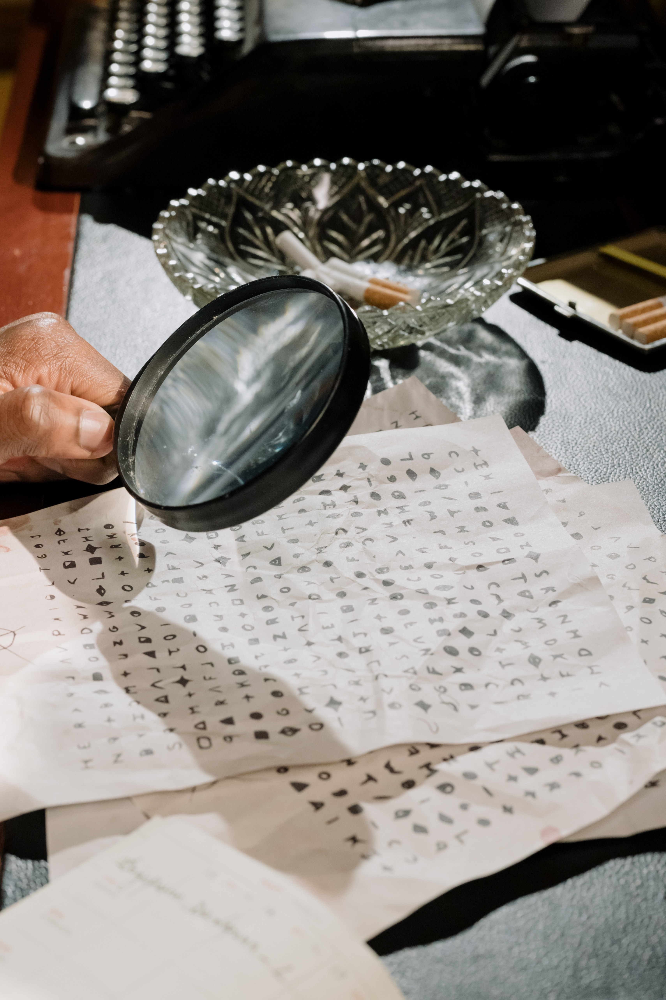
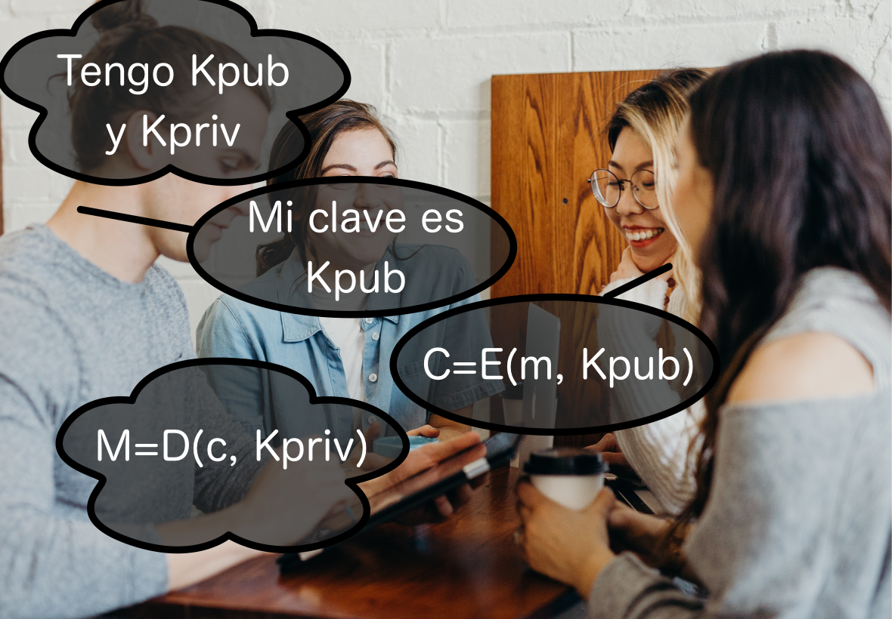
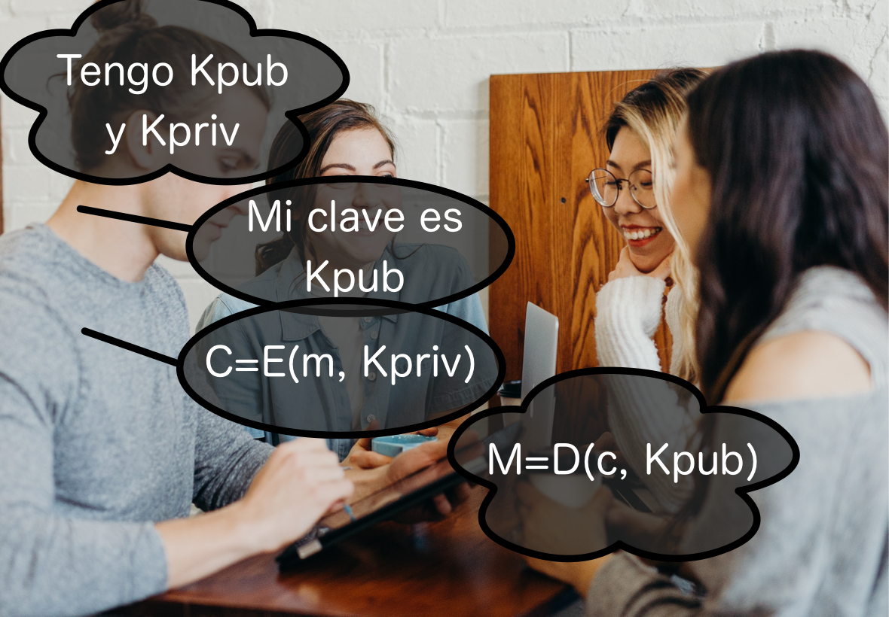
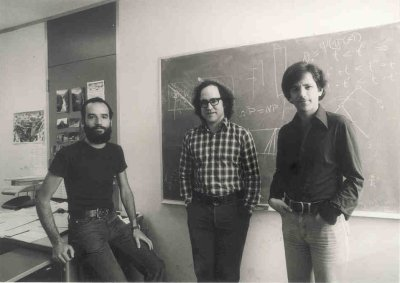
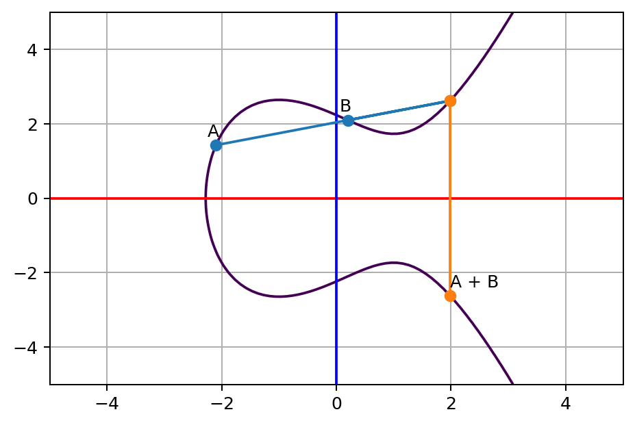
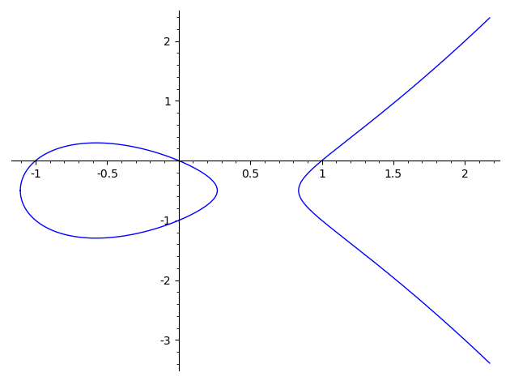

# Confidencialidad: sistemas de cifrado
<!-- _class: first-slide -->

**Seguridad computacional, cifrado asimétrico y cifrado asimétrico**

Juan Vera del Campo - <juan.vera@campusviu.es>

## Recordatorio: servicios de seguridad

- **Confidencialidad**: solo el legítimo destinatario debe poder ser capaz de leer el contenido del contrato o cualquier información asociada.
- **Integridad**: el destinatario debe ser capaz de verificar que el contenido del contrato no ha sido modificado por el camino... ni en el futuro
- **Autenticidad**: el destinatario debe ser capaz de verificar que el emisor es realmente el autor del contrato
- **No repudio**: nadie puede decir que ese no es el contrato que ha firmado

Hoy hablaremos del primero, confidencialidad, y empezaremos a poner las bases para los demás

# Hoy hablamos de...
<!-- _class: cool-list toc -->

1. [Confidencialidad perfecta y computacional](#5)
1. [Criptografía simétrica o de clave secreta](#19)
1. [Criptografía asimétrica o de clave pública](#44)
1. [Conclusiones](#70)

---
<!-- _class: with-info -->

Esta sesión es un resumen de la asignatura "Criptografía y teoría de códigos", donde desarrollamos los conceptos en seis sesiones. Encontrarás aquí más detalles técnicos de cada tema:

- <https://juanvvc.github.io/crypto/02-historia.html>
- <https://juanvvc.github.io/crypto/03-simetrica.html>
- <https://juanvvc.github.io/crypto/04-complejidad.html>
- <https://juanvvc.github.io/crypto/05-asimetrica.html>

No podemos aprenderlo todo hoy. Objetivo de la sesión: saber qué son los sistemas de cifrado simétrico y asimétrico y cuándo se usa cada uno. **Fíjate en estos cuadros azules**

# Confidencialidad perfecta y computacional
<!-- _class: lead -->

---
<!-- _class: with-info -->

**Confidencialidad perfecta** (*perfect secrecy*): un sistema es perfectamente seguro si y solo si para cualquier distribución de probabilidad sobre el espacio de mensajes en claro, y para todos los mensajes en claro y para todos los textos cifrados posibles, la probabilidad condicionada de $m$ dado $c$ y la probabilidad de $m$ coinciden:

$$
P[m|c] = P[m]
$$

Encontrarás explicaciones y ejemplos en el [tema 1](01-conceptos.html)

Sistema con confidencialidad perfecta: un atacante no podría descifrarlo nunca, invierta el dinero que invierta e independientemente de por cuántos siglos lo intente

<!--
Desde que los matemáticos entraron en la criptografía, existe definiciones de todos los términos tan exactas y formales como incomprensibles para un profano

Cosas que implica:

- Dado un texto cifrado, no conocemos nada de su texto en claro
- Dado un texto cifrado, el mensaje en claro podría ser cualquiera:
-->

## Requisitos para la confidencialidad perfecta

Tenemos confidencialidad perfecta si y solo si usamos un cifrado con las siguientes características:

- una clave tan larga como el mensaje
- totalmente aleatorio y no conocida por el atacante, ni siquiera en parte
- la clave no se usa nunca más

Durante 30 años, desde los años 40 a los 70, este sistema se conocía como **one-time-pad**, "libro de claves un solo uso", y era el más usado.

## La confidencialidad perfecta no es práctica
<!-- _class: with-info -->

Preferimos sistemas:

- Que usen claves pequeñas
- Que nos permitan resusar la misma clave

Un sistema así es imposible que sea perfecto, pero ¿puede ser lo suficientemente seguro?

Preferimos sistemas que, aunque puedan descifrarse, el atacante tenga que dedicar tantos recursos que no le sea práctico

## Relajando la perfección

- **Confidencialidad perfecta**: a partir del texto cifrado no es posible deducir ninguna propiedad del texto en claro aunque el atacante tenga **capacidad computacional infinita**
- **Confidencialidad computacional**: a partir del texto cifrado no es posible deducir ninguna propiedad del texto en claro aunque el atacante tenga **capacidad computacional razonable**

>  Imagen: Nitin Jain, Birgit Stiller, Imran Khan, Dominique Elser, Christoph Marquardt & Gerd Leuchs (2016) "Attacks on practical quantum key distribution systems (and how to prevent them)". [DOI: 10.1080/00107514.2016.1148333](https://www.tandfonline.com/doi/abs/10.1080/00107514.2016.1148333)

## Seguridad computacional
<!-- _class: with-info -->

**Seguridad computacional**: un sistema es seguro computacionalmente si cualquier algoritmo probabilístico en tiempo polinomial solo puede romper el algoritmo con probabilidad negligible en $\|n\|$

Informalmente: un atacante no puede descifrar el mensaje:

- ni juntando todo el dinero y la tecnología actual
- ...probablemente
- ...y quizá en el futuro sí se pueda

Con la seguridad computacional hay que definir el objetivo: "quiero un sistema criptográfico que mantenga este mensaje secreto durante los próximos 100 años"

<!-- Desde que los matemáticos entraron en la criptografía, existe definiciones de todos los términos tan exactas y formales como incomprensibles para un profano

Lo importante es que relajamos el sistema lo suficiente como para que, por un tiempo determinado, ningún atacante con unos recursos razonables pueda descifrar el mensaje -->

---

La criptografía es una de las ramas más pesimistas de la ciencia. Asume la existencia de adversarios con capacidad ilimitada de ataque, los cuales pueden leer todos tus mensajes, generar información ilegítima o modificar tus claves aleatorias a su antojo.

Curiosamente, también es una de las ramas más optimistas, mostrando cómo incluso en el peor escenario inimaginable el poder de las matemáticas y la algoritmia puede sobreponerse a cualquier dificultad.

[Alfonso Muñoz, Evasión de antivirus y seguridad perimetral usando esteganografía, 2021](https://raw.githubusercontent.com/mindcrypt/libros/master/Libro%20Estegomalware%20-%20Evasi%C3%B3n%20de%20antivirus%20y%20seguridad%20perimetral%20usando%20esteganograf%C3%ADa%20v1%20-%20Dr.%20Alfonso%20Munoz%20-%20mindcrypt.pdf)

## Ataques de fuerza bruta
<!-- _class: with-info -->

La criptografía computacionalmente segura permite $\|k\| \ll \|m\|$

- Es un cifrado práctico: la clave es mucho más pequeña que el mensaje y por tanto es fácil de distribuir
- Pero si es muy pequeña, es posible hacer fuerza bruta: probar claves una a una hasta que encontremos la que es

Hay que usar un espacio de claves lo suficientemente grande como para que no sea posible hacer fuerza bruta **hoy en día**, y lo suficientemente pequeño como para que sea práctico

<!-- Recordad: en el cifrado de Verman no sabíamos si habíamos encontrado una clave porque, dado un mensaje cifrado, existe una clave que puede dar cualquier mensaje imaginable con la misma longitud que el original

Ahora no sucede así: si al descifrar por fuerza bruta encontramos algo con sentido, con gran probabilidad hemos encontrado la clave y el mensaje es el original

Recordad: los ordenadores mejoran constantemente.

Los algoritmos se diseñan para que, con la tecnología actual, se tarde miles de años en hacer fuerza bruta. Pero la tecnología mejora con el tiempo, y eso también se tiene en cuenta: aunque "se venda" que un cifrado "no puede romperse en miles de años", en realidad eso es relativo a la tecnología actual y el algoritmo tiene una caducidad de unas pocas décadas.

La mejor estrategia puede ser simplemente esperar 20 años para tener un ordenador que haga esa misma fuerza bruta de forma instantánea
-->

---

- podemos probar $10^6$ clave/CPU/s $\approx 2^{20}$ clave/CPU/s
- ó $10^{13}$ clave/CPU/año $\approx 2^{43}$ clave/CPU/año
- ó $10^{16}$ clave/año con $1000$ CPU ≈$\approx 2^{53}$ clave/CPU·año
- ó $10^{19}$ clave/año con $10^6$ CPU $\approx 2^{63}$ clave/año
- ó $10^{25}$ claves con $10^6$ CPU un millón de años $\approx 2^{83}$ 
- ó $10^{29}$ claves con $10^6$ CPU desde el Big Bang $\approx 2^{96}$ 

Si tengo una "suerte media" sólo nos hará falta la mitad de las pruebas

Con hardware ad-hoc podemos llegar a multiplicar por $10^4$ ó $10^5$ veces
($2^{13}$ ó $2^{17}$ veces). Ejemplo: Bitcoin

## Fortaleza de un sistema de cifrado
<!-- _class: with-info -->

[El NIST recomienda](https://csrc.nist.gov/publications/detail/sp/800-57-part-1/rev-5/final) (2020, sección 5.6.3) claves en las que un atacante
tenga que hacer $2^{112}$ pruebas de fuerza bruta.

A partir del 2030 prevé recomendar que un atacante tenga que realizar $2^{128}$ pruebas

**Fortaleza**: números de pruebas (en bits) que tiene que hacer un atacante para descifrar un mensaje

> Otras recomendaciones: <https://www.keylength.com/en/compare/>

<!-- algunos sistemas necesitan claves mucho más largas que la media de claves que tiene que probar un atacante para descifrarlos. Esto sucede en los sistemas asimétricos, por ejemplo. La fortaleza en estos sistemas es menor que la longitud de la clave -->

## Rompiendo algoritmos
<!-- _class: with-info -->

Cuando la comunidad criptográfica rompe un algoritmo, se sustituye por otro

... pero es mejor prevenir: los algoritmos caducan y se cambian antes de que estén rotos

Un algoritmo está **criptográficamente roto** si se conoce un ataque más eficiente que la fuerza bruta

---

<!--
Estos son los algoritmos de seguridad computacional que utilizamos

Esta sesión estudiaremos las dos primeras ramas: clave pública y clave secreta

La próxima sesión estudiaremos los algoritmos de hash
-->

## Criptografía simétrica / clave secreta
<!-- _class: two-columns -->

- La misma clave para cifrar que para descifrar
- Problema: ¿Cómo acuerdan las dos partes la clave?

## Criptografía asimétrica / clave pública
<!-- _class: two-columns -->

- Una clave para cifrar, una clave diferente para descifrar
- Problema:
    - No supimos cómo hacerla hasta los años 70
    - Es lenta y compleja

# Criptografía simétrica o de clave secreta
<!-- _class: lead -->

AES y ChaCha

## Criptografía simétrica o de clave secreta

Usa la misma clave para cifrar que para descifrar

Ambas partes tienen que conocer la clave

¡Rapido y sencillo!

Ejemplos actuales: AES, ChaCha

Ejemplos rotos y obsoletos: RC4, DES, TDES

> Fondo: <https://www.pexels.com/photo/photo-of-person-using-magnifying-glass-7319077/>

## Criptografía simétrica: tipos

Flujo|Bloque
--|--
Más rápido|Más lento (a menos que exista ayuda del hardware)
Fácil de programar: pequeños dispositivos|Más complejo
Implementado en software|Implementado en hardware
RC4, **ChaCha20**|3DES, **AES**

<!--
Nosotros veremos en detalle los algoritmos ChaCha20 y AES, que los dos más utilizados actualmente

- **Cifrado de flujo**. Heredero de "la idea" *one-time-pad*: el mensaje llega como un flujo de bytes que se cifra según va llegando.
- **Cifrado de bloque**. Heredero de "la tradición" Vigenère: el mensaje se divide en bloques que se cifran por separado

-->

## Cifrado de flujo

Basado en los bloques de una solo uso (*one-time-pad*)

Idea: crea una clave tan larga como el mensaje:

$$
\|k_{\text{generada}}\| = \|m\|
$$

...a partir de una clave $k$ de longitud corta...

$$
k \overset{PRNG}{\longrightarrow} k_{\text{generada}}
$$

para después hacer:

$$
c = k_{\text{generada}} \oplus m
$$

---

PRNG: *Pseudo Random Number Generator*

<!--
PRNG: *Pseudo Random Number Generator* es un generador de bits que tiene como entrada una **semilla** (que será la clave de cifrado $k$) y tiene como salida el flujo de bits que aplicaremos sobre el mensaje para cifrarlo con *XOR*

La velocidad del cifrado depende totalmente de la velocidad del PRNG, porque el XOR es instantáneo
 -->
 
 ---

La seguridad del cifrado depende del generador PRNG utilizado...

...**y de que nunca se envíen dos mensajes cifrados con la misma clave**

(vamos a repetir esto muchas veces en el curso)

[Lorenz SZ](https://en.wikipedia.org/wiki/Lorenz_cipher#Cryptanalysis) fue una máquina alemana de cifrado de flujo, rota porque un operador envió dos mensajes diferentes seguidos sin cambiar la clave.

## ¿Cómo hacer cifrado de flujo? Intento 1
<!-- _class: smaller-font with-info -->

Supongamos que tenemos una función PRNG, y usamos una clave k como semilla del PRNG para cifrar un flujo de datos en una conexión

Si ciframos dos mensajes cifrados $c_1$ y $c_2$ con la misma clave (semilla), un atacante puede hacer:

$$
\begin{aligned}
c_1 \oplus c_2  &= (k_{\text{g}} \oplus m_1) \oplus (k_{\text{g}} \oplus m_2) \\
                &= k_{\text{g}} \oplus m_1 \oplus k_{\text{g}} \oplus m_2 \\
                &= k_{\text{g}} \oplus k_{\text{g}} \oplus m_1 \oplus m_2 \\
                &= (k_{\text{g}} \oplus k_{\text{g}}) \oplus (m_1 \oplus m_2) \\
                &= (\{000\cdots000\}) \oplus (m_1 \oplus m_2) \\
                &= m_1 \oplus m_2
\end{aligned}
$$

¡Un atacante puede hacer XOR de los dos textos cifrados y obtener el XOR de los textos en claro!

Nunca hay que usar la misma clave (ni generada) con dos mensajes diferentes

> Información adicional: [Chosen plaintext attacks](https://en.wikipedia.org/wiki/Chosen-plaintext_attack)

<!--
Qué puede hacer un atacante con el xor de los textos en claro:

- Análisis frecuencia: La "clave para cifrar m2" es m1, que ya no es aleatorio y permite el análisis de frecuencias.
- Si partes de m1 son conocidas, es aún más sencillo descifrar partes de m2

Es decir, este esquema falla ante ataques de "chosen plaintext attacks": si el enemigo puede forzarnos a cifrar algo, el sistema está roto.

Los algotitmos se diseñan para ser resistenentes a ciertos problemas. Por ejemplo, ese "chosen plantext attack", que es un juego como el que hemos visto antes. Puedes encontrar otros ataques en: https://en.wikipedia.org/wiki/Attack_model

Mira el ejemplo de ataque japonés en el Pacífico de wikipedia
-->

## Intento 2

Generar **variaciones de las claves en cada transmisión**

Supongamos que la semilla no es directamente la clave, sino una función de la clave y otro parámetro $r$

$$
k_{generada} = PRNG(f(k, r))
$$

Y $r$ lo enviamos con cada transmisión: $c' = c \| r$

Ahora la semilla "es diferente" con cada tranmisión

Pero tenemos que asumir que un atacante conoce $r$ porque monitoriza nuestras comunicaciones

## *Nonce*: *number used only once*

Curiosamente: **¡esto es correcto!**: reservar algunos bits de la clave para un contador:

SESAMO_1, SESAMO_2, SESAMO_3...

Este elemento se conoce como *nonce* y forma parte de muchos algoritmos criptográficos

---

El cifrado de flujo es tan seguro como:

- La corrección de la hipótesis de que la función PRNG sea realmente PRNG
- El espacio de claves (de semillas) sea tan grande que sea improbable que un ataque de fuerza bruta sea factible
- Que se cumplan las hipótesis de uso:
	- clave diferente en cada comunicación
	- *nonce* y $k$ escogidos totalmente el azar.

<!--

**Nota**: hasta hace poco, un buen algoritmo PRNG no es sencillo de hacer, o no es rápido. Hasta la aparición de Salsa20, la falta de buenos algoritmos PRNG hacían preferir el cifrado simétrico de bloque que veremos en un momento.

-->

## Ejemplos
<!-- _class: with-info -->

- RC4 (histórico): obsoleto
- **ChaCha**: derivado del Salsa20 y probablemente la única alternativa al AES en TLS 1.3
    - $\|k\|=256\ bits$
    - $\|nonce\|=64\ bits$

ChaCha es el algoritmo de cifrado simétrico de flujo más usado

## Cifrado de bloque
<!-- _class: with-info -->

Alternativa al cifrado de flujo: cortar el texto en claro en bloques de la misma longitud de la clave y cifrar cada uno de los bloques

El cifrado de bloque es el muy utilizado: es rápido, no necesita exigentes o lentos algoritmos PRNG y ya tenemos hardware especializado en su cifrado/descifrado

<!--
Nota importante: la figura muestra un cifrado de bloque totalmente inseguro, como veremos en un momento

Fíjate: los bloques no tienen memoria, al contrario de lo que pasaba en el cifrado de flujo. Veremos que esto es una de sus debilidades.
-->

## Modos de operación
<!-- _class: with-warning -->

Los cifrados de bloque se organizan como "modos de operación": como ordenamos las cajas de cifrados y descifrados.

Cada modo de operación tiene ventajas y desventajas según para qué queremos usar el sistema

Atención: hay un modo de operación que no debe usarse nunca

---

Si acumulamos estado durante el cifrado, podemos utilizar este estado sobre el cifrado del siguiente bloque:

- **ECB**: *Electronic Code-Book*,
    - no debe usarse
- **CBC**: *Cipher Block Chaining*
    - el bloque $i−1$ se aplica $\otimes$ sobre el bloque en claro $i$
- **OFB**: *Output Feedback*
    - cifras el cifrado anterior, y el resultado $\otimes$ del mensaje en claro
- **CTR**: *Counter*
    - cifras un contador, y el resultado $\otimes$ del mensaje en claro

## ECB: Electronic Code-Book

---
<!-- _class: center with-info -->

Fallo obvio: está usando la misma clave para cifrar mensajes diferentes.

**Eso nunca se puede hacer.**

 

No se debe usar un cifrado de bloque en modo ECB

## CBC: Cipher Block Chaining

## OFB: Output Feedback

## CTR: Counter

## Vector de Inicialización (IV)

Los distintos encadenados requieren de una semilla inicial para empezar el encadenado: vector de inicialización (IV), que cumple la misma función que un *nonce*.

Esto hace que en lugar de transmitir $n$ bloques como en ECB, haga falta transmitir $n+1$

- IV en CBC: es el hipotético bloque cifrado $−1$
- IV en OFB: es el bloque que se cifra constantmente $e(e(e(...e(IV))))$ y se aplica sobre los bloques en claro (con $\otimes$)
- IV en CTR: es el valor inicial del contador que se cifra ECB, y se aplica sobre los bloques en claro (con $\otimes$)

`AES_128_CTR` es efectivamente un cifrado de flujo, siendo $k$ la semilla, y el IV el *nonce*

## Advanced Encryption System (AES)

Desarrollado por Vincent Rijmen y Joan Daemen (aka: Rijndael), que ganaron el concurso celebrado por el NIST para sustituir a DES en 2001.

[AES (FIPS 197, 2001)](https://nvlpubs.nist.gov/nistpubs/FIPS/NIST.FIPS.197.pdf) es un cifrado de bloque:

- longitud de bloque: 128 bits (16 Bytes)
- longitud de clave: 128, 192 ó 256 bits

> background: https://whatsupcourtney.com/wp-content/uploads/2017/10/Things-to-do-in-Leuven-52-e1560945504897.jpeg

<!--
AES fue desarrollado por Vincent Rijmen y Joan Daemen en el COSIC de la KU Leuven, Bélgica.

Es totalmente ubicuo en la seguridad actual: se usa para todo, en todos lados. ChaCha20 es el único algoritmo que puee hacerle sombra.

Hay hardware especializado en cifrar y descifrar AES, entre ellas las CPUs de computadora de sobremesa.
-->

## Rendimiento

- AES-128: 1,1 Gbps (seguridad 128 bit)
- AES-192: 0,9 Gbps (seguridad 192 bit)
- AES-256: 0,7 Gbps (seguridad 256 bit)
- Salsa20: 3,2 Gbps (seguridad 256 bit)
- ChaCha20: 3,2 Gbps (seguridad 256 bit)
- AES "hardware": ~8 veces más rápido (Intel, 2011)
- DES: 250 Mbps (seguridad 56 bit)
- 3DES: 100 Mbps (seguridad 112 bit)

# Comparación flujo y bloque
<!-- _class: center -->

 
Flujo|Bloque
--|--
Más rápido|Más lento (a menos que exista ayuda del hardware)
Fácil de programar: pequeños dispositivos|Más complejo
Implementado en software|Implementado en hardware, mucho soporte ya desplegado
RC4, **ChaCha20**|3DES, **AES**

# Problema del cifrado simétrico

El cifrados de flujo (ej. ChaCha) y de bloque  (ej. AES) permiten enviar mensajes computacionalmente seguros

Solo necesitamos que las dos partes tenga una clave secreta en común

¿Cómo conseguimos que las dos personas que no se han visto nunca tengan una clave secreta común?

<!--
Parecería que con lo que conocemos ya hemos resuelto el problema de comunicar dos personas de forma secreta

Pero en realidad tenemos un "elefante en la habitación": ¿cómo se intercambian una clave de forma segura dos personas que no han hablado nunca antes, ni tienen otra forma de comunicació que Internet?

Este es el problema de intercambio de clave. No fue resuelto hasta 1976 con una serie de conceptos completamente nuevos: cada persona tiene dos claves, una pública conocida por todo el mundo y otra privada y secreta. El algoritmo inventado en 1976 se llama Diffie-Hellman, y aún lo estamos utilizando.

Antes de empezar necesitaremos un poco de teoría de complejidad. Vamos allá.
-->

---

El protocolo de intercambio de claves Diffie-Hellman permitió por primera vez en la historia que dos personas cualquiera que no se conocían mantuviesen una conversación confidencial por medios dgitales...

...pero su artículo no se llamó "Solución al problema de intercambio de claves". Tenía un título mucho más ambicioso: [Nuevas direcciones en la criptografía](https://citeseerx.ist.psu.edu/viewdoc/summary?doi=10.1.1.37.9720)

¿Qué direcciones eran esas?

> Foto: https://www.publicdomainpictures.net/en/view-image.php?image=363738&picture=signpost-giving-directions (CC0)

# Criptografía asimétrica o de clave pública
<!-- _class: lead -->

Diffie-Hellman, RSA y curvas elípticas

## Firmado digital de contratos

[New Directions in Cryptography](https://citeseerx.ist.psu.edu/viewdoc/summary?doi=10.1.1.37.9720) (Whitfield Diffie y Martin Hellman, 1976) exploraba qué se necesitaba para que dos empresas pudiesen firmar un contrato mercantil:

1. **Confidencialidad**, sin tener una clave secreta común
1. **Autenticación** de la identidad (llamada "autencidad de usuario" en el paper original)
1. **Integridad** del contrato (llamada "autenticidad del mensaje")
1. **No repudio** del contrato por ninguna de las partes

Es la lista que conocemos como "los servicios básicos de seguridad" (tema 1)

---

El primer punto, "confidencialidad", se resolvía con los cifrados que estaban apareciendo ese mismo año (DES)...

...pero se necesitaba intercambiar primero una clave simétrica

Propuesta: protocolo de intercambio de claves

Y se dieron cuenta: se puede extender la misma idea para solucionar todo lo demás

## Criptografía asimétrica

También conocida como **criptografía de clave pública**

Cada persona tiene dos claves:

- $pk$: clave pública, todos la conocen
- $sk$: clave secreta, **nadie más la conoce**

A veces son intercambiables: lo que se cifra con una se descifra con la otra

> Compara con criptografía simétrica: misma clave para cifrar y descifrar, Bob y Alice tienen que manetenarla en secreto

## Esquema de cifrado

- Todos conocen la clave $K_{pub}$ de Bob, solo Bob conoce la clave $K_{priv}$
- **Cualquier puede cifrar un mensaje para Bob, solo Bob puede descifrarlo**: confidencialidad

## Esquema de firma electrónica

- Solo Bob puede cifrar con su clave $K_{priv}$ y cualquier puede descifrar con $K_{pub}$
- Pero si pueden descifrar el mensaje, **todos saben que el mensaje solo puede haberlo enviado Bob: autenticación**

## *Trap door functions*, funciones trampa
<!-- _class: with-success -->

Las matemáticas de la criptografía asimétrica utilizan funciones trampa:

- Si conoces $a$, entonces calcular $A=f(a)$ es fácil (problema P, tiempo polinomial)
- Si conoces $A$, entonces calcular $a=f^{-1}(A)$ es muy difícil (problema NP, tiempo exponencial)

No encontramos una función trampa hasta 1976

## Problema del Logaritmo Discreto
<!-- _class: a-story -->

Resuelve la $x$:

- $$2^x = 1024$$
* $$x = \log_2(1024) = 10$$
* Eso es fácil y se puede extender a cualquier problema similar:
* Si te dan $n$ y $N$ y te preguntan $n^x=N$...
* $x = \log_n N$

> Para más detalles de este problema, consulta [tema 4](04-complejidad.html)

---
<!-- _class: a-story -->

Resuelve la $x$:

- $2^x \mod 19 = 13$
* Ten en cuenta: $0 \le x \lt 19$. Puedes probar los números uno a uno
* Solución: $x = 5$
* Si no has podido resolverlo, no es porque no tengas suficientes conocimientos... es que no sabemos hacerlo rápidamente: [Problema del Logaritmo Discreto](https://es.wikipedia.org/wiki/Logaritmo_discreto) (DLP)
* ...pero calcular  $2^5 \mod 19 = 13$ es rápido
* El DLP es una *trap door function*

<!--
en realidad no sabemos si el DLP es difícil: solo lo sospechamos muy fuertemente
-->

## Protocolo Diffie-Hellman: intercambio de claves simétricas

Utilizado para acordar una clave simétrica entres dos personas antes de las comunicaciones

Idea básica:

1. Bob envía a Alice una parte de la clave simétrica que usarán, cifrándola con la clave pública de Alice.
1. Alice envía a Bob una parte de la clave simétrica que usarán, cifrándola con la clave pública de Bob.
1. La clave final es la combinación de ambas partes, que solo las conocen Alice y Bob

---
<!-- _class: smaller-font -->

Dos usuarios $Alice$ y $Bob$ que no se han visto nunca:

1. Acuerdan $g$ y $p$ primos entre sí
1. Escogen números en secreto $a$ y $b$
1. Se envían entre ellos:
    - $Alice \rightarrow Bob: A=g^{a} \mod p$
    - $Bob \rightarrow Alice: B=g^{b} \mod p$
1. Calculan en secreto:
    - $Alice$: $s = B^{a} \mod p = g^{ab} \mod p$
    - $Bob$: $s = A^{b} \mod p = g^{ab} \mod p$
1. Y usan $s$ como clave de cifrado un algoritmo simétrico  

**Observa**: para que un atacante que solo conoce $g$, $p$, $A$ y $B$ (claves públicas) pueda calcular $s=A^b$, tiene que resolver $B=g^b \mod p$, que se supone difícil

## Claves secretas y claves públicas
<!-- _class: with-info -->

Paso 1 |Qué sabe Alice|Qué sabe Bob|Qué es público
--|--|--|--
1|$g$, $p$|$g$, $p$|$g$, $p$
2|$a$, $g^a$|$b$, $g^b$|
3|$g^b$|$g^a$|$g^a$, $g^b$
4|$g^{ab}$|$g^{ab}$|

Alice y Bob, que no se habían visto nunca antes, puede utilizar $s=g^{ab}$ como clave de un cifrado simétrico de flujo o bloque como ChaCha20 ó AES

## Nuevas direcciones

El DLP, en la versión D-H de 1976, no una solución completa: permite hacer acuerdo de claves, pero no cifrado

En pocos años aparecieron nuevas funciones basadas en esas ideas: **RSA**, ElGammal, DSA, Pailier...

Luego, las soluciones se refinaron con curvas elípticas: ECDH (*Elliptic Curves Diffie-Hellman*), ECDSA (*Elliptic Curves DSA*)...

## RSA: claves públicas y privadas

Fue el primer método de cifrado conocido que usaba claves públicas y privadas

Sigue usándose en la actualidad

[A method for obtaining digital signatures and public-key cryptosystems](https://citeseerx.ist.psu.edu/viewdoc/summary?doi=10.1.1.607.2677), Ron **R**ivest, Adi **S**hamir, Leonard **A**dleman, 1978

Está basado en la dificultad en factorizar números grandes

> Background: https://hsto.org/getpro/habr/post_images/453/10e/602/45310e602d784a489301bf1996edef68.jpg

<!--
Fundaron la empresa RSA Security LLC, que sigue siendo uno de los mayores proveedores de seguridad del mundo

- Hablamos de Ron Rivest en el tema 3, creador de RC4
- Adi Shamir hizo más aportaciones fundamentales a la criptografía
- Leonard Adleman ha seguido investigando en teoría de la complejidad
-->

## El protocolo RSA: generación de par de claves
<!-- _class: smaller-font -->

1. Escoge dos números $p$, $q$ primos
1. Calcula: $n = pq$. Su número de bits es el **tamaño de clave**
1. Calcula:
    - Protocolo original: $\phi = (p-1)(q-1)$
    - Versión moderna: $\phi = mcm(p-1, q-1)$
1. Escoge al azar $e \lt \phi$ que sea coprimo de $\phi$ (sin factores en común)
1. Calcula: $d = e^{-1} \mod \phi$
1. Claves:
    - $sk=\{d, n\}$
    - $pk=\{e, n\}$
1. Se descartan $p$, $q$, $\phi$

## El protocolo: cifrado y descifrado

Cifrado: Para enviar un mensaje a Alice, obtengo su clave pública $pk_A=\{e, n\}$ y calculo:

$$c=m^e \mod n$$

Descifrado: Alice utiliza su clave privada $sk_A=\{d, n\}$

$$m'=c^d \mod n$$

## Velocidad de proceso
<!-- _class: with-info -->

Para crear el par de claves hay que buscar:

- números muy grandes que sean primos (y otras condiciones): $p$ y $q$
- número muy grande $e$ que sea coprimo de $pq$
- inversos de un número entero: $d=e^{-1} \mod \phi$

Es decir: la elección de un par de claves **es un proceso muy lento**. Segundos, minutos, horas si las claves son grandes

A cambio: el cifrado y descifrado **son relativamente rápidos** comparados con otros sistemas de cifrado asimétrico

El cifrado asimétrico es muy lento comparado con cualquier proceso de cifrado simétrico

## Tamaño de claves
<!-- _class: with-info -->

Hemos visto que tanto Diffie-Hellman como RSA necesitan números primos

Los números primos están muy separados entre sí: el número de primos menores que $N$ es $\approx \ln(N)$

Ejemplo: hay $\approx\ln(2^{4096})=2839$ números primos menores de $2^{4096}$

"Son pocos primos"

La criptografía asimétrica necesita claves mucho más largas que la criptografía simétrica

> Fuente: https://en.wikipedia.org/wiki/Prime_number_theorem
> Gráfico: https://en.wikipedia.org/wiki/Ulam_spiral

---

Simétrica (bits)|RSA (bits)|D-H ($p$, $q$)
--|--|--
80|1024|1024, 160
128|3072|3072, 224
192|7680|7680, 384
256|15360|15360, 512

Es decir: para intercambiar una clave AES-256 aprovechando todos sus bits, necesitamos claves RSA de 15360 bits

Si usamos tamaños de clave RSA de 4096 bits (tamaño típico), podremos intercambiar una clave simétrica equivalente a AES-128

<!--
Nota: podemos intercambiar claves AES-256 con un D-H de 1024 bits. Solo que, de forma efectiva, solo estaremos escogiendo 80 bits de la clave AES-256. Es decir, sería equivalente a un (no existente) AES-80
-->

## Curvas elípticas
<!-- _class: with-info -->

Propuestas como *trap door function* en 1987 por Neal Koblitz y Victor S. Miller de forma independiente

- **Ventaja**: necesitan menos proceso y memoria, se pueden implementar en máquinas pequeñas: móviles, tarjetas inteligentes...
- **Problema**: teoría matemática compleja

Necesitan claves **más cortas** que la criptografía asimétrica basadas en DLP o RSAP para ofrecer una **seguridad equivalente**

## Trap door function

Dado un punto $A$, definimos una operación "proyección" $A+B = C$ como:

$C$ es "la proyección de recta que une $A$ y $B$, reflejada al otro lado de la curva"

Usamos el símbolo "suma" por tradición, pero no es una "suma geométrica"

---

Y lo volvemos a aplicar, varias veces, desde el mismo origen

---

En vez de empezar con dos puntos, podemos empezar con uno solo, y la recta inicial es la tangente a la cura. El resto sigue igual

$$P=nA$$

> Fuente: https://medium.com/@icostan/animated-elliptic-curves-cryptography-122fff8fcae

---

Esta es la *trap door function*:

$$ P = nA$$

Es la aplicación de $n$ veces la proyección sobre el punto $A$

Dado $P$ y $A$... ¿cuánto vale $n$?

**Eso es el problema difícil de las curvas elípticas:**

## Tamaño de clave

La gran ventaja de las curvas elípticas en criptografía (EEC) es que nos permiten utilizar criptografía asimétrica con una clave **mucho más pequeña**

Simétrica|RSA|D-H ($p$, $q$)|Curvas elípticas
--|--|--|--
80|1024|1024, 160|160
128|3072|3072, 224|256
192|7680|7680, 384|384
256|15360|15360, 512|512

Es decir, pone la criptografía asimétrica al alcance de pequeños dispositivos

<!--

A cambio, son más complejas de entender y programar pero eso como usuarios no es algo que importe

-->

---

NOTA: RSA está basado en "factorización", DSA y D-H en "logaritmo discreto"

> https://www.keylength.com/en/compare/
# Conclusiones
<!-- _class: lead -->

---

Característica|Cifrado simétrico|Cifrado asimétrico
--|--|--
Eficiencia|Muy rápido|Lento
Claves|1 (secreta, compartida)|2 (una pública y otra privada)
Tamaño de clave|256 bits|15360 bits (RSA), 512 bits (curvas elípticas)
Servicios|Confidencialidad|Autenticación, integridad, intercambio de claves simétricas (Diffie-Hellman)
Ejemplos|AES, ChaCha|RSA, ECDSA, ECDH

<!--
ECDSA: Elliptic Curve DSA
ECDH: Elliptic Curve Diffie-Hellman
-->
 
## Resumen
<!-- _class: smaller-font -->

- Confidencialidad computacional: hoy en día no es práctico romperla (en 30 años, quizá sí)
- Fortaleza de un algoritmo: "esfuerzo" necesario para romper un sistema. Relacionado con la longitud de la clave.
- Cifrados simétricos: misma clave para cifrar y descifrar
	- Cifrado de flujo:
		- A partir de una clave corta, generamos un flujo "pseudoaleatorio" tan largo como el mensaje. cifrado y descifrado=`RANDOM XOR MENSAJE`.
		- Ejemplos: RC4 (antiguo), ChaCha20
	- Cifrado de bloque:
		- Se divide el mensaje en bloques, cada bloque se cifra por separado.
		- Es necesario utilizar el modo de funcionamiento adecuado
        - Ejemplos: 3DES (no se usa en protocolos modernos), AES
- Es necesario evitar cifrar dos mensajes diferentes con la misma clave

---

- Criptografía asimétrica: cada persona tiene dos claves, una para cifrar y otra para descifrar. Una de esas claves es pública (es decir, cualquiera puede conocer la clave pública de otra persona) y la otra es secreta
- Muchísimo **más lenta** que el cifrado simétrico
- Se utiliza para:
    - intercambiar claves simétricas (Diffie-Hellman, ECDH)
    - firmado e identidad digital (RSA, ECDSA)
- Ejemplos clásicos: RSA, DSA, D-H. Están basados en el problema de la factorización de números primos y logaritmo discreto. Necesitan tamaños de clave grandes y eso dificulta su implementación
- Las curvas elípticas (EC) permite claves mucho más pequeñas = más rápidos
- Ejemplos modernos: ECDH, ECDSA, que son adaptaciones de D-H y DSA sobre curvas elípticas

## Referencias

- [The Salsa20 family of stream cipher](https://cr.yp.to/snuffle/salsafamily-20071225.pdf), Daniel J. Bernstein, 2017
- [Block Cipher Techniques](https://csrc.nist.gov/projects/block-cipher-techniques), NIST
- [Recommendation for Key Establishment Using Symmetric Block Ciphers](https://csrc.nist.gov/CSRC/media/Publications/sp/800-71/draft/documents/sp800-71-draft.pdf), NIST 800-71, 2018
- [Algorithms, key size and parameters report 2014](https://www.enisa.europa.eu/publications/algorithms-key-size-and-parameters-report-2014), ENISA, 2014

---

- [Nuevas direcciones en la criptografía](https://citeseerx.ist.psu.edu/viewdoc/summary?doi=10.1.1.37.9720) Whitfield Diffie y Martin Hellman, 1976
- [Asymmetric Encryption - Simply explained](https://www.youtube.com/watch?v=AQDCe585Lnc)
- [Diffie-Hellman Key Exchange explained (Python)](https://medium.com/@sadatnazrul/diffie-hellman-key-exchange-explained-python-8d67c378701c)

Las curvas elípticas son un concepto complejo. Esto son algunas propuestas explicativas:

- [¿Por qué pueden utilizarse las curvas elípticas para cifrar?](https://www.youtube.com/watch?v=vi2wvAQsy-A), píldoras CriptoRED
- [Elliptic Curve Cryptography Overview](https://www.youtube.com/watch?v=dCvB-mhkT0w), de John Wagnon. No asume conocimientos de álgebra.
- [Elliptic Curve Diffie Hellman](https://www.youtube.com/watch?v=F3zzNa42-tQ): Vídeo sobre ECDH y curvas elípticas en general de Robert Pierce. Asume conocimientos de álgebra.

---

<!-- _class: center -->

Continúa en: [Funciones de Hash y firma digital](03-hashes.html)

# ¡Gracias!
<!-- _class: last-slide -->
