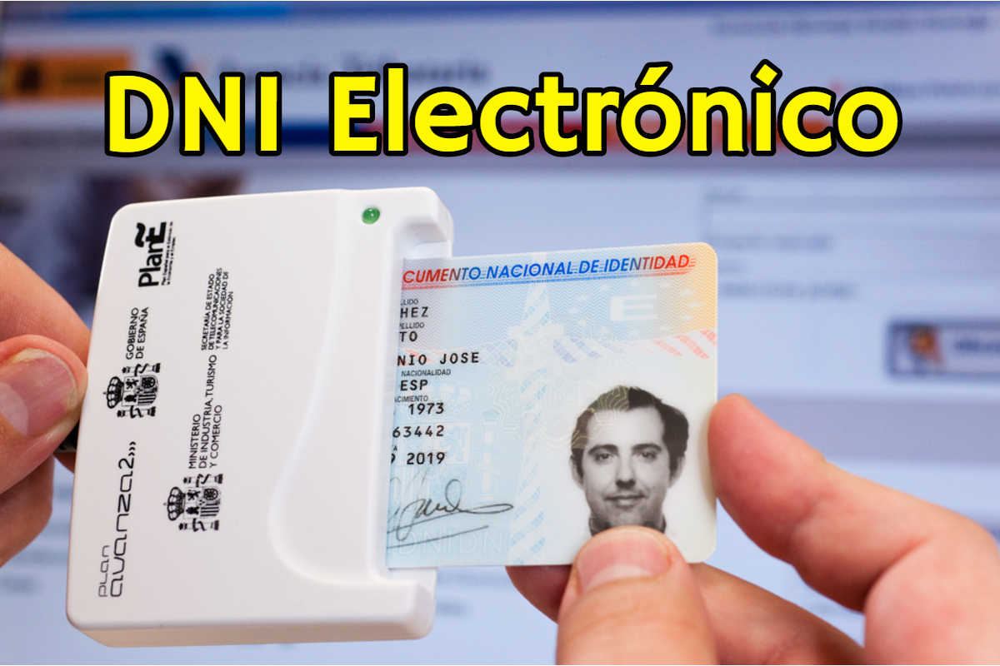

<style>
    /* You can add custom style here. VSCode supports this.
    Other editor might need these custom code in
    the YAML header: section: | */
	/* section header { display: none; } */
	/* section footer { display: none; } */
</style>

# Firma digital
<!-- _class: first-slide -->

Juan Vera del Campo - <juan.vera@campusviu.es>


# Como decíamos ayer...

- **Confidencialidad**: AES/ChaCha20 + D-H
- **Autenticidad**: RSA + firma digital
- **No repudio**: RSA + firma digital
- **Integridad**: firma digital

Los hashes nos permiten calcular **una firma digital**


# Hoy hablamos de...
<!-- _class: cool-list toc -->

1. [Firma digital: punto de vista técnico](#4)
1. [Firma digital: punto de vista legal](#14)
1. [Conclusiones](#24)

# Firma digital: punto de vista técnico
<!-- _class: lead -->

---

Podemos proteger la **integridad, no-repudio y autenticidad de un mensaje** mediante una combinación de hash y cifrado asimétrico

- Bob tiene un documento que quiere firmar
- Bob tiene también una clave pública y otra privada
- Alice conoce la clave pública de Bob

## Esquema de firma electrónica


- Solo Bob puede cifrar con su clave $K_{priv}$ y cualquier puede descifrar con $K_{pub}$
- Pero si pueden descifrar el mensaje, **todos saben que el mensaje solo puede haberlo enviado Bob: autenticación**

---

Problema: los documentos a firmar pueden ser muy grandes

* Los algoritmos como RSA solo cifran **números enteros** de una longitud igual a la clave. Por ejemplo, 4096 bits.
* Bob podría dividir el documento en bloques de 4096B, pero eso no es eficiente
* Solución: **hash cifrado con la clave privada**
    - Bob calcula el hash de su documento de 10MB. El hash tiene 512 bytes
    - Bob cifra el hash con su clave privada
    - Cualquiera persona (eso incluye a Alice) puede conocer la clave pública de Bob y descifrar el hash
    - Si se encuentra un documento con un hash firmado por una clave pública, cualquier persona puede verificar que el autor del documento es el poseedor de la clave privada.

> https://cryptobook.nakov.com/digital-signatures/rsa-signatures


## Firma digital

Solución: cifrar solo el hash del mensaje

En firma digital se cifra el hash del mensaje con nuestra clave privada

$$
Firma_{Bob}(document) = E_{RSA}(K_{priv}^{Bob}, hash(document))
$$

$$
Verificacion(document, Firma_{Bob}) = (D_{RSA}(K_{pub}^{Bob}, Firma_{Bob}) =^? hash(document))
$$

---

Cifrando **el hash de un mensaje** con nuestra clave privada, aseguramos que ese mensaje lo hemos enviado nosotros y cualquier puede verificarlo


Firma digital de un mensaje = cifrado del hash de un mensaje con mi clave privada

---


> https://wizardforcel.gitbooks.io/practical-cryptography-for-developers-book/content/digital-signatures.html

## Ejemplo: Debian firma sus imágenes

- Ejemplo: https://danilodellaquila.com/en/blog/how-to-verify-authenticity-of-downloaded-debian-iso-images
- Archivos: https://cdimage.debian.org/debian-cd/10.9.0-live/amd64/iso-hybrid/

---


---

(archivo anterior, *hasheado* y cifrado con clave privada de Debian)

```
-----BEGIN PGP SIGNATURE-----

iQIzBAABCAAdFiEE35ucSeqpKYQyWJ122ofoDWKUvpsFAmBfrDUACgkQ2ofoDWKU
vpsNrRAAh+bSjSbiIXcugkI9faItOdKnwM+JaqGFRrDVK68Qbc/Y5Nv4Z8KmhL/a
7nlzOrwA7dyEWFuwRiyLpoZOnlNLTXLWr8/7UJhJGt//2vJFpoHmBcXKnRFeZHfE
4XXhAq7XA/naPoTHfbuEAFVqZlnWhewBtsvwL3cn/FwyvsujCxEK9LtXl6L7ziK5
Am6LcIB6TJe3shMeUSRmvhF+d/dZ1LTYKwmm4SkCLsp0Z52dg8eRUpbq2uyQpkHM
TdtC0kE4a2u7GmDZD+VIggslfHS2tm3vE9RLfWcobjoF51bvowrPGFGm9tg+ANFt
We+sUDNv+cAUrTq9dfwoDBJueR4IRxAZoEKyl4V4mxtRsawG6w0Uzz66qrq7ROUn
isBz3sGBcNerI6uOUfP/U1mMmDMsjbaVSQCUsM9Pzpt8Y39vHgzMVwTGOkfzgUZJ
Qcf+cqyGDSpin2DjcPlUAKKtGdnnWDPVPskrgSTxzQmV8n+VgEiGRW1y46i5sh4t
dc4ETsKoz2H1JFVJY/t3kAthHCAkW/hhDX4mBM8ZPSdfNZiXNNOZGu673VwLI/bN
pN8+FgezKfD8iZHWZxHk++91Kj8sZVToVI3m8rL5nKvhEKLFNS7XDq2bmKKbtF0t
kKw8HI5Tzv55YG0P4oToeLpE6ajxxZVrCAGJvD6lMiyfftOYU2A=
=KWqY
-----END PGP SIGNATURE-----
```

# Firma digital: punto de vista legal
<!-- _class: lead -->

## Desde un punto de vista legal...

- Firma: artículo 3.11
    - Persona física
    - Autenticación, no repudio, integridad
    - Misma función que firma manuscrita
- Sello: artículo 3.26
    - Persona jurídica
    - Autenticación e integridad


> [Reglamento (UE) 910/2014 del Parlamento Europeo y del Consejo, de 23 de julio de 2014 relativo a la identificación electrónica y los servicios de confianza para las transacciones electrónicas en el mercado interior](https://www.boe.es/doue/2014/257/L00073-00114.pdf)

## Propiedades de firmas y sellos

- Vinculadas de forma única creador
- Permite la identificación del creador: **autenticación**
- Solo controlada por el creador
- Permite probar que el creador ha tenido acceso al documento: sabe qué está firmando
- Permite detección de alteraciones en el documento: **integridad**
- Necesita la utilización de un dispositivo informático


## Firma cualificada

Firma electrónica aceptada por la administración

¡No tiene por qué ser la mejor!

Caso DNI-e en España: mínima implantación por problemas de usabilidad

Se exige personarse presencialmente en una agencia de certificación



## Fecha de firma

Además del contenido del documento, es necesario asegurar cuándo se ha realizado la firma digital, y las condiciones en las que se ha hecho:

- La fecha y hora actual, que estará firmada digitalmente por alguien confiable
- Que la firma era válida en el momento del firmado

Veremos más detalles técnicos en el tema de certificados

## Usos

La administración solo admite firmas/sellos electrónicos cualificados

En Europa, asimilables a firma manuscrita o sello de entidad

ojo: firmas no cualificadas **podrían tener también efectos jurídicos**

## Un poco de historia: ROCA

The ROCA factorization attack could potentially allow a remote attacker to reverse-calculate a private encryption key just by having a target’s public key

Algunas tarjetas utilizaban una implementación no segura

Se tuvieron que retirar todas y [no aceptar firma electrónica durante ese periodo](https://elpais.com/politica/2017/11/09/actualidad/1510217634_470836.html)


> https://crocs.fi.muni.cz/public/papers/rsa_ccs17

---

Del anuncio de la vulnerabilidad (https://crocs.fi.muni.cz/public/papers/rsa_ccs17): 

The time complexity and cost for the selected key lengths (Intel E5-2650 v3@3GHz Q2/2014):

- 512 bit RSA keys - 2 CPU hours (the cost of $0.06);
- 1024 bit RSA keys – 97 CPU days (the cost of $40-$80);
- 2048 bit RSA keys – 140.8 CPU years, (the cost of $20,000 - $40,000).

## Delegación de firma

- Sellos “por poderes”: una persona firma en nombre de una empresa
- Sistema “Cl@ve”: la administración firma por nosotros

## Certificados electrónicos

- Declaración electrónica que vincula los datos de validación de un sello con una persona jurídica y confirma el nombre de esa persona
- Declaración que permite autenticar un sitio web y vincula el sitio web con la persona física o jurídica a quien se ha expedido el certificado
- La norma exige que se gestione el ciclo de vida de un certificado. Revocaciones, cambios de estado...

Los veremos en la siguiente sesión


# Conclusiones
<!-- _class: lead -->

## Resumen

- Las funciones de hash reducen un mensaje de cualquier tamaño (pocos bits o gigas de información) en un conjunto de pocos bytes
- SHA-2 (SHA-256 ó SHA-512) es el más usado. Debe evitarse MD5 o SHA-1
- Usos:
    - Firma digital: cifrado con clave asimétrica del hash de un mensaje, para probar autoría e integridad
    - Bitcoin
    - Cadena de custodia
    - HMAC (integridad)
- Firma digital = cifrado con clave privada del hash de un documento

## Referencias

- [Hashing Algorithms and Security - Computerphile](https://www.youtube.com/watch?v=b4b8ktEV4Bg)
- [The State of Hashing Algorithms — The Why, The How, and The Future](https://medium.com/@rauljordan/the-state-of-hashing-algorithms-the-why-the-how-and-the-future-b21d5c0440de)
- [Base legal de la Firma Electrónica (España)](https://firmaelectronica.gob.es/Home/Ciudadanos/Base-Legal.html)
- [What are Digital Signatures? - Computerphile](https://www.youtube.com/watch?v=s22eJ1eVLTU)

---

Ejercicios: <https://colab.research.google.com/github/Juanvvc/crypto2/blob/main/ejercicios/03/Hashes.ipynb>

Sigue el tema en:

- [Firma digital](03-firma.html)
- [Blockchain](03-blockchain.html)

Siguiente tema:

- [TLS y Public Key Infrastructure](04-pki.html)

# ¡Gracias!
<!-- _class: last-slide -->
