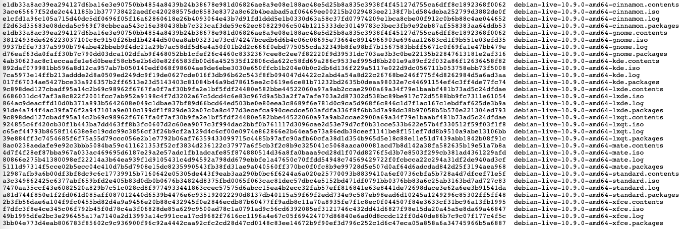

<style>
    /* You can add custom style here. VSCode supports this.
    Other editor might need these custom code in
    the YAML header: section: | */
	/* section header { display: none; } */
	/* section footer { display: none; } */
</style>

# Funciones de Hash y Firma digital
<!-- _class: first-slide -->

Juan Vera del Campo

<juan.vera@campusviu.es>


# Como decíamos ayer...

- **Confidencialidad**: AES/ChaCha20 + D-H
- **Autenticidad**: RSA + firma digital
- **No repudio**: RSA + firma digital
- **Integridad**: firma digital

Los hashes nos permiten calcular **una firma digital**


# Hoy hablamos de...
<!-- _class: cool-list -->

1. [Funciones de hash](#4)
1. [Usos](#22)
1. [Firma digital: punto de vista técnico](#33)
1. [Firma digital: punto de vista legal](#42)
1. [Resumen y referencias](#50)

Ejercicios: https://github.com/Juanvvc/crypto2/tree/master/ejercicios/03

# Funciones de hash
<!-- _class: lead -->

## Función de hash, digest o resumen

Resume un mensaje $m$ de longitud arbitraria en un valor $r$ **de tamaño fijo $l$**, sea cual sea la longitud del mensaje

$$
\begin{aligned}
r &= h(m)\\
\end{aligned}
$$

Ejemplos:

- "Resumir" un mensaje de 12 bytes en 32 bytes
- Resumir una imagen de 532KB en 32 bytes
- Resumir una película de 4GB en 32 bytes

## Ejemplos no criptográficos

- Bit de paridad un mensaje: número de "1" en el mensaje
- CRC
- Checksum

Todos estos son resúmenes, pero no son de utilidad en criptografía


> https://es.wikipedia.org/wiki/Verificaci%C3%B3n_de_redundancia_c%C3%ADclica

<!--
Los bits de paridad o los CRC se utilizan mucho con protocolos que esperan errores: RS232, lectura de CDs, la parte de paridad de un RAID... Un código de detección/corrección de errores se puede entender también como un "resumen" del mensaje: si el resumen no coincide con lo recibido, entonces sabemos ue ha habido un error.

Pero estas funciones, en general, no sirven en criptografía: imagina que un atacante puede cambiar un mensaje y también su resumen. Entonces, ¡no nos sirve de nada validar que el resumen sea correcto!
-->

## Funciones de hash criptográficas

Funciones hash criptográficas son aquellas que:

- Son funciones resumen: comprimen la entrada a una salida de menor longitud
- Son fáciles y rapidas de calcular
- **Propiedades adicionales**:
    - Dado un resumen, no es posible calcular el mensaje original
    - No es factible encontrar dos mensajes con el mismo resumen

Dado un mensaje $m$ con un resumen $r=h(m)$, para encontrar otro mensaje $m'$ con el mismo resumen, $r=h(m)=h(m')$, la manera más eficiente tiene que ser probar mensajes uno a uno: fuerza bruta

> https://en.wikipedia.org/wiki/Cryptographic_hash_function


## Ejemplos de valores de hash


<!--
Ejemplos de valores de hash:

- el primero "resume" un texto "Fox" en otro más largo: la función de hash siempre tiene la misma longitud, incluso si el texto es corto: SHA-256 siempre dará un resumen de 256 bits sea como sea el texto de entrada.
- Los demás son variaciones del mismo texto de entrada. Fíjate: pequeñas variaciones dan un hash diferente a simple vista

¿Qué tenemos que cambiar en "The red fox jumps over the blue dog" para que tenga el mismo hash? Es decir, para que el hash no detecte el cambio. Ya que el texto es mayor de 256 bits, sabemos seguro que habrá otro texto que tendrá el mismo resumen. Pero lo único que podemos hacer es probar cambios uno y otro hasta tener suerte!
-->

## Requisitos de una función de hash criptográfica

- Que sea rápida de calcular
- Resistencia a la preimagen: dado un hash, no se puede saber el mensaje exacto que tiene ese hash
- Resistencia a la colisión: dificultad para encontrar dos mensajes diferentes con el mismo hash
- Sensibilidad: un cambio mínimo en el mensaje produce un hash totalmente diferente

> https://en.wikipedia.org/wiki/Cryptographic_hash_function#Properties

## ¿Cuántos hashes podemos calcular por segundo?

Los hashes se usan mucho en minería bitcoin, así que podemos utilizar sus tablas para conocer velocidades:

- ARM1176JZ(F)-S (Raspberry): 0.2 MH/s
- NVidia GTX1080: 222MH/s
- Bitmain AntMiner D3: 19,3 GH/s
- Avalon 6: 3.5 TH/s


> Más ejemplos: https://miningchamp.com/
> En la imagen, un Avalon 6, bloque especializado en calcular hashes

## ¿Mensajes con el mismo resumen?
<!-- _class: with-success -->

Obvio: no puede existir una aplicación inyectiva entre un conjunto de $m$ elementos y otro de $n$ elementos si $m>n$

Existen infinitos mensajes diferentes con el mismo resumen: esto se llama "colisión"


> [Principio del palomar](https://es.wikipedia.org/wiki/Principio_del_palomar)

<!--
El principio del palomar dice que si tienes 9 agujeros y 10 palomas, es necesario que dos palomas compartan agujero. Puede parecer una obviedad, pero a veces se nos pasan las obviedades:

Si los mensaje de 1.000.000 de caracteres se resumen en 256 caracteres... ¡por fuerza varios mensajes tendrán el mismo resumen!
-->

## Paradoja del cumpleaños

En realidad hay un ataque a la resistencia a la colisión que deriva de la paradoja del cumpleaños:

*si tenemos un grupo de 23 personas, la probabilidad de tener un par con la misma fecha de cumpleaños es del 50%*

Sólo hace falta que el grupo llegue a 70 personas para que la probabilidad sea del 99%


> Foto: [nappy](https://www.pexels.com/photo/group-of-people-standing-on-metal-stairs-3063910/), free to use

---
<!-- _class: with-success -->

Si tenemos un hash de tamaño $\|r\|$ la probabilidad de colisión será muy alta a medida que nos acercamos a las $\sqrt{\|r\|}$ operaciones

Para $\|r\|=256$ bits esto son unas $\sqrt{2^{256}} = 2^\frac{256}{2} = 2^{128}$ operaciones

Esto implica que para un hash hacen falta resúmenes el doble de largos de lo que hacía falta para las claves simétricas para obtener el mismo nivel de seguridad

La *security strength* de una función de hash de longitud $b$ bits es $b/2$

## Ejemplos de funciones de hash


- MD5: utilizado mucho tiempo. [Totalmente roto desde 2008](https://www.win.tue.nl/hashclash/rogue-ca/): no hay que usarlo.
- SHA-1: 160 bits. [En la actualidad se considera roto](https://empresas.blogthinkbig.com/nuevo-ataque-sha-1-explicacion/)
- SHA-2: longitudes de 256 b y 512 b. Son conocidos como **SHA-256 y SHA-512**.
- SHA-3: longitudes entre 224 b a 512 b

Los hashes recomendados en la actualidad son el SHA-2 (cualquier de las dos variantes) y el SHA-3

Fíjate: longitudes aproximadamente el doble que las longitudes de claves que las claves de AES (128 b, 192 b, 256 b) para una seguridad equivalente

---
<!-- _class: with-warning -->

Ejemplos de valores de hash MD5, SHA256 y SHA512 de esta presentación:

```
> ms5sum 03-hashes.md
c99fe5e1ec0f637d77dddb32b1679c21  03-hashes.md

> sha256sum 03-hashes.md
06efc998ac8ad6867b4f1a9ee94d903503c0c52e6f1184a9561000eb303844ec  03-hashes.md

> sha512sum 03-hashes.md 
64b378a66da3714e723ac8469525ac7b460d7ad7ff348b9453d177907a14fd4a
445a11c07206b7df599bcf3ec70475a6e89b4bbfe605c928c36494ff1a31311d  03-hashes.md
```

Si calculas los valores de hash del archivo, verás que no coinciden. Eso es porque no se puede calcular el hash de un archivo, meter el hash en el propio archivo, volver a calcular el hash ¡y que dé lo mismo! Recuerda: cualquier cambio (como por ejemplo meter el hash) cambia totalmente el hash

## Visual SHA-256

[](https://sha256algorithm.com/)

> https://sha256algorithm.com/

## ¿SHA-2 ó SHA-3?

La familia SHA-2 está **diseñada** por la NSA, la familia SHA-3 fue **escogida** por el NIST después de organizar una competición para definir el siguiente hash a utilizar

El SHA-3 se ha desarrollado teniendo en cuenta la eficiencia y como backup en caso de encontrar vulnerabilidades en el SHA-2 (diseños totalmente diferentes)

El SHA-2 hasta ahora ha sido sometido a un trabajo de análisis muy superior al SHA-3 y  no se han encontrado ninguna vulnerabilidad

## Construcción

Formas de construir una función de hash:

- A partir de un cifrado de bloque en un modo realimentado: el hash es el último bloque. Posible, pero lento.
- [Merkle–Damgård](https://en.wikipedia.org/wiki/Merkle%E2%80%93Damg%C3%A5rd_construction): es el ejemplo mostrado en la figura. MD5, SHA-1, SHA-2... usan este método
- [SHA-3](https://en.wikipedia.org/wiki/SHA-3): utiliza función Keccak


## Ataque: rainbow table

[Tablas de consulta](https://es.wikipedia.org/wiki/Tabla_arco%C3%ADris) que ofrecen un compromiso para obtener claves en texto simple a partir del resultado de una función de hash.

Son bases de datos:

$$hash \rightarrow mensaje$$


> https://project-rainbowcrack.com/table.htm

---

Ejemplo:

```sh
$ echo -n sesame | sha256sum
d0c04f4b1951e4aeaaec8223ed2039e542f3aae805a6fa7f6d794e5afff5d272  -
$ echo -n hello | sha256sum
2cf24dba5fb0a30e26e83b2ac5b9e29e1b161e5c1fa7425e73043362938b9824  -
$ echo -n hola | sha256sum
b221d9dbb083a7f33428d7c2a3c3198ae925614d70210e28716ccaa7cd4ddb79  -
$ echo -n jñkjhafdiu232332 | sha256sum
b12ee96400fa19e7909a48f1727d3c81f6af71178209b58b612b5d2e75bf2d13  -
```

https://crackstation.net/


---
<!-- _class: extra-slide -->

En este curso no hacemos criptoanálisis, es decir, no rompemos cosas. Si estáis interesados, se puede intentar romper hashes:

- Simplemente buscándolos en google
- Usando alguna *rainbow table*
- Usando diccionarios de "contraseñas probables"
- Herramientas como [John the Ripper](https://www.openwall.com/john/) o [CrackHash](https://pypi.org/project/crackhash/) aprovechan estas técnicas

# Usos
<!-- _class: lead -->

Árboles de Merkle, Integridad, Cadena de custodia...

## Merkle Hash tree
<!-- _class: smaller-font -->

Si un archivo gran cambia a menudo y hay que calcular su hash cada vez, llevará mucho tiempo

Solución: calcular hash solo de los bloques que cambien, y agruparlos en un árbol

Permite firmar bases de datos, discos... de forma eficiente


## Almacenamiento de contraseñas

El sistema operativo no debe guardar las contraseñas de los usuarios: si alguien consigue entrar, ¡obtiene la contraseña del usuario!

Podemos guardar simplemente su hash: $hash(contraseña)$

Pero esto tiene un problema: muchos usuarios usan palabras, nombres, etc. limitados. Las palabras, nombres conocidos són del orden de ≈100.000

Un atacante realizar un "diccionario" con el hash de todas las palabras, nombres, etc. (ataque de diccionario y rainbow table)

## Almacenamiento de contraseñas: *salt* y bcrypt

1. Añadir un valor aleatorio o $salt$ y tamibén lo guardamos: $hash(salt\|contraseña)$
1. Hashear varias veces o implementar un hash "costoso":

$$hash(hash(hash(...hash(salt\|contraseña))))$$


<!--
En la imagen se puede ver un ejemplo de cómo guarda una base de datos una contraseña protegida con bcrypt

Nota: bcrypt no es exactamente un hash con salt sino un cifrado con contraseña conocida, aunque tiene la misma función que un hash. Se usa bcrypt porque es más lento que un hash, y eso añade seguridad adicional

La cadena es lo que guardará la base de datos. Incluye los campos, separados con $:

- Identificador del algoritmo: 2y
- Número de operaciones de hash repetidas. En realidad es base 2: 2^10
- Salt
- hash(password||salt)

-->

## Integridad de mensajes

Se puede usar un hash para asegurar la integridad de un mensaje: [HMAC](https://en.wikipedia.org/wiki/HMAC)

$$
HMAC(k, m) = hash(E_k(m))
$$

<!--

Integredidad Capacidad de **detectar** si un mensaje ha sido modificado desde su transmisión hasta su recepción.

La modificación se refiere tanto a una modificación **explícita por un atacante** como a una modificación debido a un error (por ejemplo de transmisión). 

> https://es.wikipedia.org/wiki/Integridad_del_mensaje

-->

---

- **Encrypt-then-MAC** (EtM): primero cifra, luego calcula hash 
- **Encrypt-and-MAC** (E&M): cifra y calcula hash a la vez
- **MAC-then-Encrypt** (MtE): primero calcula hash, luego cifra

Hay modos de AES que utilizan estos esquemas: [AES-GCM](https://en.wikipedia.org/wiki/Galois/Counter_Mode)

> MAC: Message Authenticated Code
> https://en.wikipedia.org/wiki/Authenticated_encryption

## Encrypt-then-MAC (EtM)
<!-- _class: two-columns -->


- Usado en IPSec
- Necesita dos claves: una para cifrar y otra para el MAC

## Encrypt-and-MAC (E&M)
<!-- _class: two-columns -->


- Usado en SSH
- Puede reutilizar clave para cifrar y calcular MAC

## MAC-then-Encrypt (MtE)
<!-- _class: two-columns -->


- Usado en TLS
- Vulnerable algún ataques de padding: [Padding Oracle, pentesterlab](https://book.hacktricks.xyz/crypto/padding-oracle-priv)

## Cadena de custodia

Cuando se investiga un crimen... ¿cómo se protegen las evidencias digitales contra modificaciones?

Inicio de cadena de custodia publicando sus hashes


## Firma digital
<!-- _class: with-success -->

Cifrando **el hash de un mensaje** con nuestra clave privada, aseguramos que ese mensaje lo hemos enviado nosotros y cualquier puede verificarlo


Firma digital de un mensaje = cifrado del hash de un mensaje con mi clave privada

# Firma digital: punto de vista técnico
<!-- _class: lead -->

---

Podemos proteger la **integridad, no-repudio y autenticidad de un mensaje** mediante una combinación de hash y cifrado asimétrico

- Bob tiene un documento que quiere firmar
- Bob tiene también una clave pública y otra privada
- Alice conoce la clave pública de Bob

---


- Solo Bob puede cifrar con su clave $K_{priv}$ y cualquier puede descifrar con $K_{pub}$
- Pero si pueden descifrar el mensaje, **todos saben que el mensaje solo puede haberlo enviado Bob: autenticación**

---

Problema: los documentos a firmar pueden ser muy grandes

* Los algoritmos como RSA solo cifran **números enteros** de una longitud igual a la clave. Por ejemplo, 4096 bits.
* Bob podría dividir el documento en bloques de 4096B, pero eso no es eficiente
* Solución: **hash cifrado con la clave privada**
    - Bob calcula el hash de su documento de 10MB. El hash tiene 512 bytes
    - Bob cifra el hash con su clave privada
    - Cualquiera persona (eso incluye a Alice) puede conocer la clave pública de Bob y descifrar el hash
    - Si se encuentra un documento con un hash firmado por una clave pública, cualquier persona puede verificar que el autor del documento es el poseedor de la clave privada.

> https://cryptobook.nakov.com/digital-signatures/rsa-signatures

## Firma digital

Solución: cifrar solo el hash del mensaje

En firma digital se cifra el hash del mensaje con nuestra clave privada

$$
Firma_{Bob}(document) = E_{RSA}(K_{priv}^{Bob}, hash(document)) \\
Verificacion(document, Firma_{Bob}) = D_{RSA}(K_{pub}^{Bob}, Firma_{Bob}) =^? hash(document)
$$

---


> https://wizardforcel.gitbooks.io/practical-cryptography-for-developers-book/content/digital-signatures.html

## Ejemplo: Debian firma sus imágenes

- Ejemplo: https://danilodellaquila.com/en/blog/how-to-verify-authenticity-of-downloaded-debian-iso-images
- Archivos: https://cdimage.debian.org/debian-cd/10.9.0-live/amd64/iso-hybrid/

---



---

(archivo anterior, *hasheado* y cifrado con clave privada de Debian)

```
-----BEGIN PGP SIGNATURE-----

iQIzBAABCAAdFiEE35ucSeqpKYQyWJ122ofoDWKUvpsFAmBfrDUACgkQ2ofoDWKU
vpsNrRAAh+bSjSbiIXcugkI9faItOdKnwM+JaqGFRrDVK68Qbc/Y5Nv4Z8KmhL/a
7nlzOrwA7dyEWFuwRiyLpoZOnlNLTXLWr8/7UJhJGt//2vJFpoHmBcXKnRFeZHfE
4XXhAq7XA/naPoTHfbuEAFVqZlnWhewBtsvwL3cn/FwyvsujCxEK9LtXl6L7ziK5
Am6LcIB6TJe3shMeUSRmvhF+d/dZ1LTYKwmm4SkCLsp0Z52dg8eRUpbq2uyQpkHM
TdtC0kE4a2u7GmDZD+VIggslfHS2tm3vE9RLfWcobjoF51bvowrPGFGm9tg+ANFt
We+sUDNv+cAUrTq9dfwoDBJueR4IRxAZoEKyl4V4mxtRsawG6w0Uzz66qrq7ROUn
isBz3sGBcNerI6uOUfP/U1mMmDMsjbaVSQCUsM9Pzpt8Y39vHgzMVwTGOkfzgUZJ
Qcf+cqyGDSpin2DjcPlUAKKtGdnnWDPVPskrgSTxzQmV8n+VgEiGRW1y46i5sh4t
dc4ETsKoz2H1JFVJY/t3kAthHCAkW/hhDX4mBM8ZPSdfNZiXNNOZGu673VwLI/bN
pN8+FgezKfD8iZHWZxHk++91Kj8sZVToVI3m8rL5nKvhEKLFNS7XDq2bmKKbtF0t
kKw8HI5Tzv55YG0P4oToeLpE6ajxxZVrCAGJvD6lMiyfftOYU2A=
=KWqY
-----END PGP SIGNATURE-----
```

# Firma digital: punto de vista legal
<!-- _class: lead -->

## Desde un punto de vista legal...

- Firma: artículo 3.11
    - Persona física
    - Autenticación, no repudio, integridad
    - Misma función que firma manuscrita
- Sello: artículo 3.26
    - Persona jurídica
    - Autenticación e integridad


> [Reglamento (UE) 910/2014 del Parlamento Europeo y del Consejo, de 23 de julio de 2014 relativo a la identificación electrónica y los servicios de confianza para las transacciones electrónicas en el mercado interior](https://www.boe.es/doue/2014/257/L00073-00114.pdf)

## Propiedades de firmas y sellos

- Vinculadas de forma única creador
- Permite la identificación del creador: **autenticación**
- Solo controlada por el creador
- Permite probar que el creador ha tenido acceso al documento: sabe qué está firmando
- Permite detección de alteraciones en el documento: **integridad**
- Necesita la utilización de un dispositivo informático


## Firma cualificada

Firma electrónica aceptada por la administración

¡No tiene por qué ser la mejor!

Caso DNI-e en España: mínima implantación por problemas de usabilidad

Se exige personarse presencialmente en una agencia de certificación


## Usos

La administración solo admite firmas/sellos electrónicos cualificados

En Europa, asimilables a firma manuscrita o sello de entidad

ojo: firmas no cualificadas **podrían tener también efectos jurídicos**

## Un poco de historia: ROCA

The ROCA factorization attack could potentially allow a remote attacker to reverse-calculate a private encryption key just by having a target’s public key

Algunas tarjetas utilizaban una implementación no segura

Se tuvieron que retirar todas y [no aceptar firma electrónica durante ese periodo](https://elpais.com/politica/2017/11/09/actualidad/1510217634_470836.html)


> https://crocs.fi.muni.cz/public/papers/rsa_ccs17

---

Del anuncio de la vulnerabilidad (https://crocs.fi.muni.cz/public/papers/rsa_ccs17): 

The time complexity and cost for the selected key lengths (Intel E5-2650 v3@3GHz Q2/2014):

- 512 bit RSA keys - 2 CPU hours (the cost of $0.06);
- 1024 bit RSA keys – 97 CPU days (the cost of $40-$80);
- 2048 bit RSA keys – 140.8 CPU years, (the cost of $20,000 - $40,000).

## Delegación de firma

- Sellos “por poderes”: una persona firma en nombre de una empresa
- Sistema “Cl@ve”: la administración firma por nosotros

## Certificados electrónicos

- Declaración electrónica que vincula los datos de validación de un sello con una persona jurídica y confirma el nombre de esa persona
- Declaración que permite autenticar un sitio web y vincula el sitio web con la persona física o jurídica a quien se ha expedido el certificado
- La norma exige que se gestione el ciclo de vida de un certificado. Revocaciones, cambios de estado...

Los veremos en la siguiente sesión


# Conclusiones
<!-- _class: lead -->

## Resumen

- Las funciones de hash reducen un mensaje de cualquier tamaño (pocos bits o gigas de información) en un conjunto de pocos bytes
- SHA-2 (SHA-256 ó SHA-512) es el más usado. Debe evitarse MD5 o SHA-1
- Usos:
    - Firma digital: cifrado con clave asimétrica del hash de un mensaje, para probar autoría e integridad
    - Bitcoin
    - Cadena de custodia
    - HMAC (integridad)
- Firma digital = cifrado con clave privada del hash de un documento

## Referencias

- [Hashing Algorithms and Security - Computerphile](https://www.youtube.com/watch?v=b4b8ktEV4Bg)
- [The State of Hashing Algorithms — The Why, The How, and The Future](https://medium.com/@rauljordan/the-state-of-hashing-algorithms-the-why-the-how-and-the-future-b21d5c0440de)
- [Base legal de la Firma Electrónica (España)](https://firmaelectronica.gob.es/Home/Ciudadanos/Base-Legal.html)
- [What are Digital Signatures? - Computerphile](https://www.youtube.com/watch?v=s22eJ1eVLTU)

---

<!-- _class: center -->

Continúa en: [TLS y Public Key Infrastructure](04-pki.html)

