<style>
    /* You can add custom style here. VSCode supports this.
    Other editor might need these custom code in
    the YAML header: section: | */
	/* section header { display: none; } */
	/* section footer { display: none; } */
</style>

# Autenticación de usuarios
<!-- _class: first-slide -->

Juan Vera del Campo

<juan.vera@campusviu.es>

# Como decíamos ayer...

[New Directions in Cryptography](https://citeseerx.ist.psu.edu/viewdoc/summary?doi=10.1.1.37.9720) (Whitfield Diffie y Martin Hellman, 1976) exploraba qué se necesitaba para que dos empresas pudiesen firmar un contrato mercantil:

1. **Confidencialidad**, sin tener una clave secreta común
1. **Autenticación** de la identidad (llamada "autencidad de usuario" en el paper original)
1. **Integridad** del contrato (llamada "autenticidad del mensaje")
1. **No repudio** del contrato por ninguna de las partes

Es la lista que conocemos como "los servicios básicos de seguridad" del [Tema 1](01-conceptos-basicos.html)

<!--
Hoy nos centraremos en la autenticación.

Fíjate: el no repudio de un documento se puede asegurar si estamos seguros de con quién estamos hablando y tenemos un medio de probar qué es lo que dice.

Es decir, no repudio = autenticidad + integridad
-->

## Hoy hablamos de...
<!-- _class: cool-list toc -->

1. [Autenticación](#4)
1. [Desafío - Respuesta](#23)
1. [Autenticación por contraseña](#31)
1. [Sesiones por tokens](#40)
1. [Security Assertion Markup Language](#58)
1. [Resumen y referencias](#62)

# Autenticación
<!-- _class: lead -->

## ¿Qué es la autenticación?

**En Internet, es fácil hacerse pasar por otra persona**

- Man in the middle
- Impersonation

Autenticación: proceso de confirmar que alguien es quien dice ser


> https://es.wikipedia.org/wiki/Autenticaci%C3%B3n
> Foto: https://www.totalentertainment.biz/rentals/entertainment/impersonators.html

<!--

Man in the middle y impersonation son muy similares, y la defensa contra ambos es la misma:

- man in the middle: Malloy se pone en medio de una comunicación entre Alice y Bob, que piensan que están hablando entre sí cuando en realidad los dos hablar con Malloy
- impersonation: Alice habla con Malloy pensando que está hablando con Bob. Puede que Bob ni sepa que hay una conversación en marcha.

La diferencia es que en el caso de man in the middle malloy tiene algo más de ventaja: si Alice pregunta algo que solo puede responder Bob, Malloy podría preguntárselo a Bob y entonces le responde a Alice.
-->

## Diffie-Hellman y el ataque Man in the Middle

El algoritmo Diffie-Hellman ([Tema 3](03-cifrado.html)) permite que dos personas que no se conocen acuerden una clave secreta común

Un atacante **no puede conocer la clave secreta**

Pero un atacante **puede convencer a cada parte que es otra persona**: así se pone en medio (*man in the middle*): D-H es vulnerable a ataques MitM.

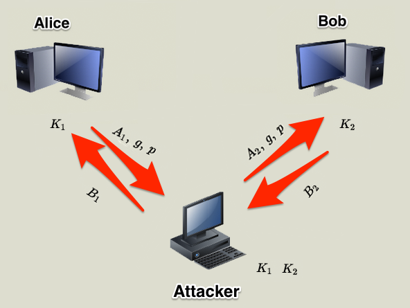

> https://www.trendmicro.com/en_us/research/15/i/how-exploit-kit-operators-are-misusing-diffie-hellman-key-exchange.html

<!--
Diffie Hellman no ofrece autenticación: vamos a acabar hablando de forma segura, sí, pero con Malloy: Alice habla con Malloy y Bob también habla con Malloy, sin saber que Malloy existe. Malloy puede limitarse a descifrar los mensajes que le envía Alice con la clave que comparte con Alice, leerlos y cifrarlos con la clave que comparte con Bob para enviarlos modificados o sin modificar.
-->

## Identidades

Para poder tener autenticación es necesaria la existencia de identidades

- Personas: su identidad física
- Webs: que el servidor de una URL sea el que tiene que ser

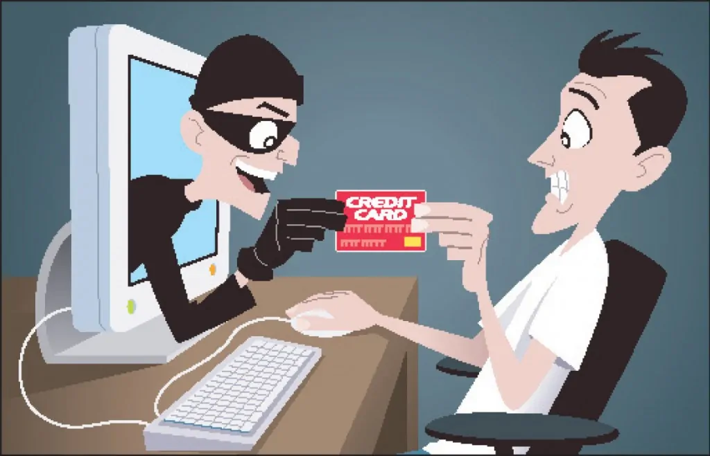

<!--
Hay muchas formas de guardar nuestra identidad en internet:

- Más informal: mi nombre de usuario, mi dirección de correo electrónico...
- Más formal: certificados, DNI electrónico...

En el caso de webs o empresas, la identidad puede ser simplemente que cuando el usuario se conecta a bancosantander.com, que el servidor que le responda es propiedad del Banco Santander

Image 
-->

## Certificados
<!-- _class: with-info -->

Certificado = (1) Identidad, (2) Clave pública de la indentidad, (3) firmado por una autoridad de certificación

Esto funciona bien en servidores: HTTPS siempre autentica servidores con certificados y, **opcionalmente**, usuarios

El uso de certificados no se ha extendido a usuarios físicos: son demasiados complejos de gestionar


Necesitamos otras soluciones para usuarios

## Factores de la autenticación

**Algo que sabemos** (*knowledge*): contraseña, PIN...

**Algo que tenemos** (*ownership*): clave privada, smartcards, Google Authentication...

**Algo que somos** (*inference*): huellas digitales, voz, cara...

**Dónde estamos** (*location*): el servidor podría también comprobar que nos estamos conectando desde el lugar y a las horas habituales

> https://searchsecurity.techtarget.com/feature/5-common-authentication-factors-to-know

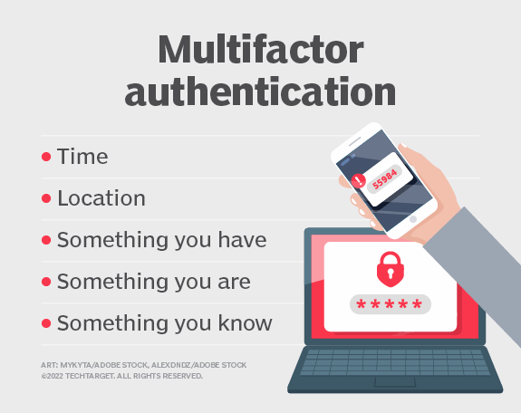

<!--
Estos son los factores clásico de la autenticación


-->

## Autenticación tradicional: algo que sabemos

Tradicionalmente solo se ha utilizado el *algo que sabemos*: la contraseña

Este sistema está poco seguro pero muy fácil de usar


---

Vulnerabilidades de *algo que sabemos*:

- Ataques de diccionario "offline"
- Muchos usuarios utilizan contraseñas del "top 100": https://en.wikipedia.org/wiki/List_of_the_most_common_passwords
- Muchos usuarios **reutilizan** contraseñas en varios lugares
- A veces es posible "adivinar contraseñas", si tienen una estructura
- A veces, el administrador de sistemas no cambia la contraseña por defecto

## Alto que *tenemos*
<!-- _class: center -->

 

- USB Keys
- Google Authenticator instalado en un teléfono
- SMS de validación

---

Vulnerabilidades de *algo que tenemos*:

- Que nos roben el dispositivo
- Que esté intervenido por un atacante
    - Troyanos bancarios
    - Malware en Android
    - Click hijacking
    - Social engineering

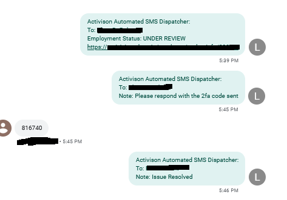

> https://www.bleepingcomputer.com/news/security/activision-confirms-data-breach-exposing-employee-and-game-info/

<!--

El hackeo reciente a Activision se produjo así: estaba activado un sistema 2FA que enviaba número de confirmación por SMS

Los atacantes inundaron a whatsapp a los trabajadores "somos el servicio téncicos, necesitamos su número de confirmación para atender una incidencia", hasta que un trabajador envió su número de confirmación

-->

## Algo que *somos*


---

Vulnerabilidades de *algo que somos*:

- [La biometría no sea una ciencia exacta](https://www.ncsc.gov.uk/collection/biometrics/how-biometrics-are-attacked)


- Si algo va mal... **no podemos cambiar nuestros datos biométricos**

> https://www.idrnd.ai/can-biometric-data-be-stolen/

## Localización y otras anomalías

- Detectar y registrar los patrones de los usuarios: localización, navegadores comunes, horarios...
- Alarmas cuando haya actividad que se salga del patrón

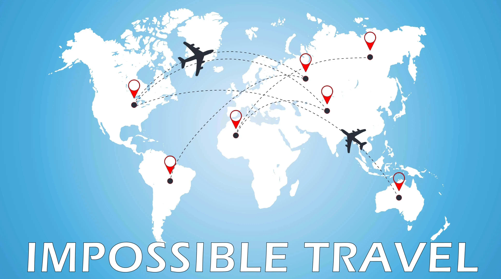

> https://sra.io/blog/impossible-travel/

---

Vulnerabilidades:

- los atacantes pueden usar *proxies* para similar que se están conectando desde el país de la víctima
- no válido para nuevos usuarios aún sin perfilar


## 2FA: Doble Factor de Autenticación

Usa al menos dos de los factores anteriores


Fíjate: si desbloqueamos el móvil con biometría, ya estamos usando los tres factores

<!--
Pregunta: ¿el orden en que se prueba cada factor importa? Es decir: ¿es lo mismo?:

- preguntar por una clave y depués por algo que tenemos
- preguntar por algo que tenemos y después por una clave

Depende del sistema, y especialmente de lo difícil que sea atacar cada paso. Interesa preguntar primero lo que sea más difícil atacar.

En el 2FA de Gmail preguntan primero por contraseña y después confirmación en el móvil. Eso es porque Gmail bloquea la cuenta si detecta muchos intentos de pruebas de contraseña: Gmail considera que "adivinar una contraseña" es más difícil que "robar un móvil".
-->

## *Passwordless / No password authentication*

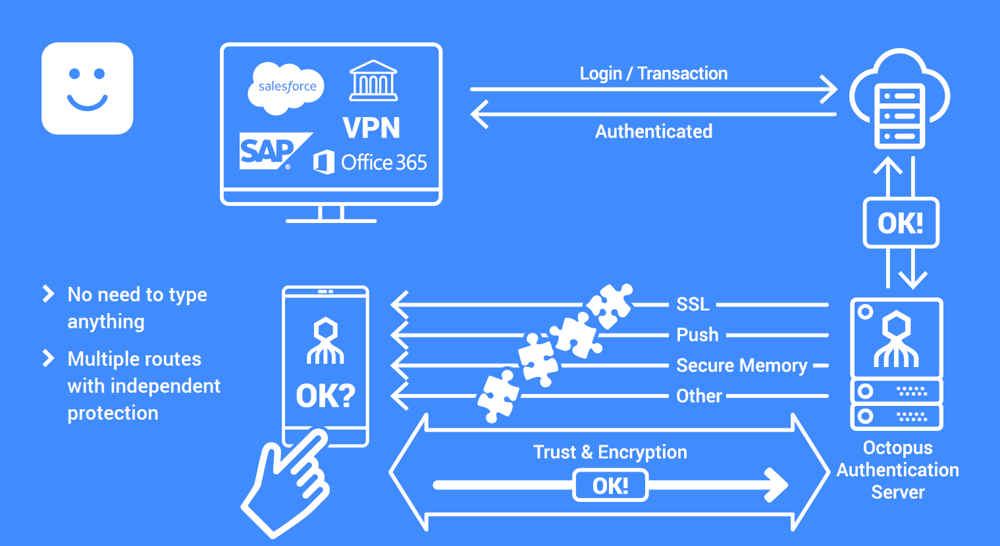

> https://doubleoctopus.com/security-wiki/authentication/passwordless-authentication/
> https://www.youtube.com/watch?v=8Na793pxKpk

## Single Sign On

En muchas webs nos podemos autenticar con nuestro usuario de **Google**, **Facebook**, **Microsoft** u **Okta**

[Microsoft](https://www.microsoft.com/en-us/security/business/identity-access-management/passwordless-authentication) y [Google](https://androidcommunity.com/google-planning-on-a-more-secure-no-password-future-20210506/) proponen que nos autentiquemos en sus sistemas solo con nuestro móvil: en el futuro próximo, ¡puede que no usemos contraseñas!


## Vulnerabilidades generales

- Si hay un equipo secuestrado y le enviamos credenciales, la hemos perdido en ese equipo y en todos los que usen la misma contraseña: redes windows, pass the hash...
- Un atacante puede repetir exactamente lo que hemos hecho: replay attack
- Un atacante puede obligarnos a hacer algo (sin que nos demos cuenta) aprovechando nuestas credenciales

## Vamos a ver tres soluciones
<!-- _class: cool-list -->

1. [Desafío-respuesta / firma digital](#21)
1. [Contraseñas / biometría](#29)
1. [Tokens](#39)

# Desafío - Respuesta
<!-- _class: lead -->

Basado en firma digital

## Desafío-Respuesta (*Challenge-Response*)

Los sistemas de CAPTCHA son un sistemas básico de autenticación por desafío - respuesta: demuestra que eres una persona

Pueden ser un **primer filtro** de entrada a tus sistemas para evitar ataques automáticos

> https://en.wikipedia.org/wiki/CAPTCHA


## TLS: autenticación de servidores
<!-- _class: with-warning -->

TLS (https) permite autenticar servidores y (opcionalmente) usuarios:

- **Autenticación de servidor**: el servidor envía su clave pública al cliente al inicio de la conexión HTTPS, que lo acepta usando PKI, como se ve en el [Tema 4](04-pki.html). En este modo, el usuario se autentica con algún sistema de este tema.
- **Autenticación doble**: servidor y cliente intercambian claves públicas, que se aceptan por PKI.

Con tener la clave pública de la otra persona no es suficiente: tenemos que **probar** que la otra persona tiene también la privada.

## ¿Es suficiente con que nos presenten una clave pública?

Una CA puede enlazar una clave pública a una identidad: "*esta es sin duda la clave pública de Juan Vera*". Eso es el certificado ([Tema 4](04-pki.html))

Pero que alguien te enseñe el certificado de Juan Vera no es suficiente para que sepas que estas hablando conmigo: mi clave pública (es decir, mi certificado) es público, cualquiera puede obtenerlo y presentarlo.

Se necesita algo más: la persona con la que hablas tiene que tener la clave privada de Juan Vera. Solo así sabrás que sin duda estás hablando con Juan Vera:

1. Tiene la clave pública de Juan Vera, avalada por alguien en quien confiamos (una CA)
1. Además, demuestra que tiene la clave privada de Juan Vera

## Desafío-Respuesta (*Challenge-Response*) usando criptografía asimétrica

Aprovechamos criptografía asimétrica: si tenemos la clave pública de una persona, podemos desafiarle:

- **Alice**: Bob, ¿eres capaz de firmar *8u2348j48749082904* con tu clave privada?
- **Bob**: $RSA_{sk_{Bob}}(8u2348j48749082904) = yuh137321h1238$
- **Alice**: si $RSA_{pk_{Bob}}(yuh137321h1238) = 8u2348j48749082904$, sabe que está hablando con Bob

> https://es.wikipedia.org/wiki/Protocolos_desaf%C3%ADo-respuesta

<!--
Aunque los CAPTCHA son ejemplos sencillos de desafío-respuesta, vamos a centrarnos en protocolos criptográficos

Como parte de otros protocolos, se suele implementar un sistemas challenge-response para probar que alguien tiene la clave privada que se corresponde con una clave pública

Fíjate:

- Cuando hablamos con alguien, nos envía su certificado con su clave pública. Con los mecanismos del tema de PKI sabemos que esa es, sin ninguna duda, la clave pública de Bob
- ¿Pero realmente estamos hablando con Bob? En realidad solo estamos hablando con alguien que TIENE la clave pública de Bob, igual que nosotros la tenemos ahora.
- Aunque sepamos que esa es sin duda la clave pública de Bob, aún es necesario asegurarse de que estamos hablando realmente con Bob. Le desafiamos a que firme algo con la clave privada que dice tener.
-->

## Proceso del desafío
<!-- _class: two-columns smaller-font -->

[](https://mermaid-js.github.io/mermaid-live-editor/edit/##eyJjb2RlIjoic2VxdWVuY2VEaWFncmFtXG4gICAgQWxpY2UtPj4rQm9iOiBIRUxMT1xuICAgIEJvYi0-Pi1BbGljZTogQ2xhdmUgcMO6YmxpY2EgQm9iXG4gICAgQWxpY2UtPj5BbGljZTogQ29tcHJ1ZWJhIHF1ZSBsYSBjbGF2ZSBww7pibGljYSBlcyBPS1xuICAgIEFsaWNlLT4-K0JvYjogQ2hhbGxlbmdlPVwiODMyN2g0aDN5XCJcbiAgICBCb2ItPj4tQWxpY2U6IFJTQSg4MzI3aDRoM3kpXG4gICAgQWxpY2UtPj5BbGljZTogQ29tcHJ1ZWJhIHF1ZSBlbCBkZWNpZnJhZG8gZXMgT0tcbiAgICBOb3RlIG92ZXIgQWxpY2UsQm9iOiBEaWZmaWUtSGVsbG1hbiBwYXJhIGFjb3JkYXIgY2xhdmUgQUVTXG4gICAgTm90ZSBvdmVyIEFsaWNlLEJvYjogQ29tdW5pY2FjacOzbiBjaWZyYWRhIGNvbiBBRVMiLCJtZXJtYWlkIjoie1xuICBcInRoZW1lXCI6IFwiZGVmYXVsdFwiXG59IiwidXBkYXRlRWRpdG9yIjpmYWxzZSwiYXV0b1N5bmMiOnRydWUsInVwZGF0ZURpYWdyYW0iOmZhbHNlfQ)

- Alice tiene que enviar una challenge diferente cada vez, que no sea predecible por un atacante
- Alice necesita algún mecanismo adicional para comprobar que esa clave pública está asociada a Bob ([tema 4](04-pki.html))

## Firma digital como challenge-response
<!-- _class: with-info -->

Fíjate: la firma electrónica sigue este esquema

*Challenge* para Bob: ¿puedes cifrar el hash de tus documentos?

$$
\begin{aligned}
challenge &= hash(documento)\\
firma &= E_{sk_{Bob}}(challenge)
\end{aligned}
$$

En firma electrónica normalmente no hará falta que Alice haga un dasafío, **Bob toma la iniciativa y envía su firma junto con el documento original antes de que le desafíen**

Documento: cualquier mensaje que Bob quiera intercambiar. No es solo un .docx, es cualquier mensaje, cadena de texto, parámetro de seguridad...

## Authenticated Diffie-Hellman
<!-- _class: smaller-font -->


Dos usuarios $Alice$ y $Bob$, cada uno tiene las claves públicas del otro

1. Acuerdan $g$ y $p$ primos entre sí
1. Escogen números en secreto $a$ y $b$
1. Se envían entre ellos:
    - $Alice \rightarrow Bob: A=g^{a} \mod p, sign(A, SK_A)$
    - $Bob \rightarrow Alice: B=g^{b} \mod p, sign(A, SK_B)$
1. Verifican la firma de cada lado
1. Calculan en secreto:
    - $Alice$: $s = B^{a} \mod p = g^{ab} \mod p$
    - $Bob$: $s = A^{b} \mod p = g^{ab} \mod p$
1. Y usan $s$ como clave de cifrado un algoritmo simétrico


> [Authentication and Authenticated Key Exchanges](https://citeseerx.ist.psu.edu/viewdoc/summary?doi=10.1.1.59.6682), Whitfield Diffie and Paul C. Van Oorschot and Michael J. Wiener, 1992.
> [Protocols PK Encr. /Auth. PK Key Establishment Secure Comm. in Open Networks SSL/TLS Nicolas Protocols PK Encr. /Auth. PK Key Establishment Secure Comm. in Open Networks SSL/TLS Nicolas T. Courtois - University College London](https://present5.com/protocols-pk-encr-auth-pk-key-establishment-secure/)

<!--
Es un Diffie-Hellman tradicional, pero los mensajes van firmados con las claves privadas de cada parte

De esta forma, si tenemos y confiamos en la clave pública de la otra parte (ver tema PKI), entonces sabemos que no se ha puesto nadie en medio de las comunicaciones

Esta es la versión de D-H implementada en SSL/TLS
-->

# Autenticación por contraseña
<!-- _class: lead -->

En esta sección: "contraseña" es algo guardado una BBDD: una clave, una huella digital...

## Seguridad de las contraseñas de usuario

1. No uses datos personales o reconocibles en tus contraseñas
2. Usa contraseñas fuertes. Idealmente: totalmente alaatorias
4. Acompañálas siempre de un doble factor de autenticación (2FA)
5. No uses la misma contraseña en varios sitios
6. Usa un gestor de contraseñas. Ejemplos: KeePass

## "Solución 1": contraseña en claro en la BBDD
<!-- _class: two-columns with-warning -->

[](https://mermaid-js.github.io/mermaid-live-editor/edit/##eyJjb2RlIjoic2VxdWVuY2VEaWFncmFtXG4gICAgQWxpY2UtPj4rQm9iOiBVc3VhcmlvIC8gUGFzc3dvcmRcbiAgICBCb2ItPj4rQkJERDogVXN1YXJpbyAvIFBhc3N3b3JkXG4gICAgQkJERC0-Pi1Cb2I6IE9LXG4gICAgQm9iLS0-Pi1BbGljZTogT0tcbiAgICAgICAgICAgICIsIm1lcm1haWQiOiJ7XG4gIFwidGhlbWVcIjogXCJkZWZhdWx0XCJcbn0iLCJ1cGRhdGVFZGl0b3IiOmZhbHNlLCJhdXRvU3luYyI6dHJ1ZSwidXBkYXRlRGlhZ3JhbSI6ZmFsc2V9)

- En la base de datos se guarda el usuario y contraseña
- Si roban la base de datos... ¡roban las contraseñas!
    - Los usuarios suelen reutilizar contraseñas
    - El administrator de la BBDD conoce nuestra contraseña

Nunca uses este método para almacenar contraseñas

<!--
La BBDD podría cifrar las contraseñas, pero eso es una solución parcial: si alguien es capaz de robar la base de datos, es muy posible que también sea capaz de robar la contraseña de cifrado.

Aún así, guardar las contraseñas cifradas es sin duda mejor que guardarla en claro. Simplemente, hay soluciones mejores que no requieren una contraseña de cifrado, como veremos a continuación

Que el adminitrador de la BBDD conozca la contraseña es un problema: ¿realmente podemos confiar en él? No sería la primera vez que el ladrón está dentro de casa, y que sea el administrador de sistemas
-->

## Solución 2: hash de la contraseña
<!-- _class: two-columns with-warning -->


[](https://mermaid-js.github.io/mermaid-live-editor/edit/##eyJjb2RlIjoic2VxdWVuY2VEaWFncmFtXG4gICAgQWxpY2UtPj4rQm9iOiBVc3VhcmlvIC8gUGFzc3dvcmRcbiAgICBCb2ItPj4rQkJERDogVXN1YXJpbyBcbiAgICBCQkRELT4-LUJvYjogXCJTYWx0XCIgZGVsIHVzdWFyaW9cbiAgICBCb2ItPj4rQkJERDogVXN1YXJpbywgaGFzaChQYXNzd29yZClcbiAgICBCQkRELT4-LUJvYjogT0tcbiAgICBCb2ItPj4tQWxpY2U6IE9LXG4gICAgICAgICAgICAiLCJtZXJtYWlkIjoie1xuICBcInRoZW1lXCI6IFwiZGVmYXVsdFwiXG59IiwidXBkYXRlRWRpdG9yIjpmYWxzZSwiYXV0b1N5bmMiOnRydWUsInVwZGF0ZURpYWdyYW0iOmZhbHNlfQ)

- Ventaja: la BBDD no guarda las contraseñas sino sus hashes. Si alguien roba la BBDD, tiene que romper los hashes
- Existen hashes especializados en huellas biométricas

Intenta evitar este método para almacenar contraseñas

<!--
Nota: Alice podría enviar o bien su contraseña, o bien su hash. Es normal que Alice envíe a Bob (una página web) la contraseña, pero Bob calcula inmediatamente el hash: Alice se fía de Bob, pero Bob no se fía de la base de datos
-->

## Análisis de seguridad

- En realidad, queremos un hash criptográfico pero **no un hash rápido**:
    - Bob solo hará la operación una vez, no pasa nada si es costosa
    - Un atacante tiene que hacer fuerza bruta: **interesa que cada intento lleve mucho tiempo**
- Se suele implementar como una serie de hashes. Ejemplo: "calculamos el hash de la contraseña 1024 veces". Así obligaríamos a un atacante a hacer un número descomunal de operaciones para cada prueba
- Problemas:
    - si varios usuarios tienen la misma contraseña... la BBDD lo sabe
    - si se usan contraseñas sencillas... se pueden romper con *rainbow tables* o tablas precalculadas de contraseñas

## Solución 3: hash de contraseña + salt
<!-- _class: two-columns with-success -->

[](https://mermaid-js.github.io/mermaid-live-editor/edit/##eyJjb2RlIjoic2VxdWVuY2VEaWFncmFtXG4gICAgQWxpY2UtPj4rQm9iOiBVc3VhcmlvIC8gUGFzc3dvcmRcbiAgICBCb2ItPj4rQkJERDogVXN1YXJpb1xuICAgIEJCREQtPj4tQm9iOiBcIlNhbHRcIiBkZWwgdXN1YXJpb1xuICAgIEJvYi0-PitCQkREOiBVc3VhcmlvLCBoYXNoKFNhbHQ6UGFzc3dvcmQpXG4gICAgQkJERC0-Pi1Cb2I6IE9LXG4gICAgQm9iLT4-LUFsaWNlOiBPSyIsIm1lcm1haWQiOiJ7XG4gIFwidGhlbWVcIjogXCJkZWZhdWx0XCJcbn0iLCJ1cGRhdGVFZGl0b3IiOnRydWUsImF1dG9TeW5jIjp0cnVlLCJ1cGRhdGVEaWFncmFtIjpmYWxzZX0)

- El "*salt*" es algo parecido al "*nonce*" ([Tema 2](02-cifrado.html)): se puede guardar en claro en la BBDD
- El *salt* tiene que ser un valor **totalmente aleatorio y diferente para cada usuario**
- Ya no es posible tener tablas precomputadas

Esta es la solución usada en la actualidad

## Análisis de seguridad
<!-- _class: with-info -->

- La BBDD guarda $hash(SALT:PASSWORD)$
    - No es vulnerable a tablas precalculadas de contraseñas
    - Si dos usuarios tienen la misma contraseña, con gran probabilidad tendrán *salt* diferente así que la BBDD no sabe que las contraseñas son iguales
    - La BBDD no conoce la contraseña original, solo el hash
- La salt tiene que ser aleatoria
- Es el mecanismo usado en Linux, Windows... y en la mayor parte de las webs
- Guardar una contraseña en una BBDD es un error, hay que guardar solo $hash(SALT:PASSWORD)$

## BCRYPT: Cifrado como "hash", nonce como "salt"
<!-- _class: with-warning -->


Esto es lo que guarda la BBDD para cada usuario

Nota: scrypt es similar a bcrypt, igualmente válido y más actual

<!--
- Entrada:
	- `password`
	- `cost`, 10 ó 12 es usual son valores usuales
	- `salt`, que se se escoge automáticamente. La *salt* es otro nombre para el *nonce*
- Derivación de clave, que es el proceso lento de Blowfish, se hace $2^{cost}$ veces.
- Cifra con la clave derivada la cadena estándar *OrpheanBeholderScryDoubt* 64 veces.

-->

## Ejemplos
<!-- _class: smaller-font -->

PWD|Bcrypt
--|--
abracadabra|`$2a$12$sWfsiB42yT.LvoyCqAHURujcDUTmEHVUjQHqTP4kL1Zs1p.j4G6Lu`
sesamo|`$2a$12$kWTGyiUbTha.bKpGXyz8ieRIYMAVNaO7gvrZMZ86DKZNgpiJzh49u`
sesamo|`$2a$12$LQbVUSGksM2vCoZiBhmKCerSTe/Uq7BWVgbxFAe8eY/9y3y1P8dzS`

```python
from Crypto.Protocol.KDF import bcrypt, bcrypt_check

password = 'sesamo'

hpwd = bcrypt(password, 12)
# $2a$12$kWTGyiUbTha.bKpGXyz8ieRIYMAVNaO7gvrZMZ86DKZNgpiJzh49u

bcrypt_check(password, hpwd)
# True
```

<!--
Fijaos que ejecutar bcrypt sobre la misma contraseña "sesamo", da resultados diferentes. De esta forma se puede guardar las contraseñas repetidas sin que ndie pueda saber que son repetidas
-->

# Sesiones por tokens
<!-- _class: lead -->

En esta sección, *credenciales* es lo que el usuario tenga para autenticarse: 2FA, contraseñas, certificados...

## Problema

Imagina una petición con HTTP (ó HTTPS)

```http
GET / HTTP/1.1
Host: www.vuelasim.com
Authorization: Basic YWxpY2U6c2VzYW1l
...
```

La cabecera *Authentication* incluye el usuario y contraseña (o su hash) codificado en Base64.

```bash
$ echo 'YWxpY2U6c2VzYW1l' | base64 -d
alice:sesame% 
```

Para evitar enviar siempre la contraseña (o su hash): sesiones por tokens


## Autenticación por token

1. El usuario envía sus credenciales
2. Si es correcto (ver sección anterior), el usuario recibe un token
3. Para el resto de peticiones el usuario envía **solo** el token
4. En cada petición, el servidor verifica que el token es correcto
    - el token **podría** está firmado digitalmente, o cifrado con una clave que solo conoce el servidor
    - el token **podría** ser un número aleatorio guardado la base de datos
    - (opcional, pero muy recomendable) con cada nueva petición, el token se renueva

> https://sherryhsu.medium.com/session-vs-token-based-authentication-11a6c5ac45e4

## Proceso
<!-- _class: two-columns smaller-font -->

[](https://mermaid-js.github.io/mermaid-live-editor/edit/##eyJjb2RlIjoic2VxdWVuY2VEaWFncmFtXG4gICAgQWxpY2UtPj4rQm9iOiBVc3VhcmlvIC8gUGFzc3dvcmRcbiAgICBCb2ItPj4rQkJERDogVXN1YXJpb1xuICAgIEJCREQtPj4tQm9iOiBcIlNhbHRcIiBkZWwgdXN1YXJpb1xuICAgIEJvYi0-PitCQkREOiBVc3VhcmlvLCBoYXNoKFNhbHQ6UGFzc3dvcmQpXG4gICAgQkJERC0-Pi1Cb2I6IE9LXG4gICAgQm9iLT4-LUFsaWNlOiB0b2tlbiA9IENpZnJhZG8odXN1YXJpbywxIGhvcmEpXG4gICAgQWxpY2UtPj4rQm9iOiBwZXRpY2nDs24sIHRva2VuXG4gICAgQm9iLT4-Qm9iOiB0b2tlbiBPSz9cbiAgICBCb2ItPj4tQWxpY2U6IHJlc3B1ZXN0YVxuIiwibWVybWFpZCI6eyJ0aGVtZSI6ImRlZmF1bHQifSwidXBkYXRlRWRpdG9yIjpmYWxzZSwiYXV0b1N5bmMiOnRydWUsInVwZGF0ZURpYWdyYW0iOmZhbHNlfQ)

- Hay una verificación inicial de usuario
- El token es $E_ {K_{Bob}}(Alice, caducidad)$. Es decir: cifrado con una clave que solo Bob conoce del nombre de Alice y una caducidad
- Una vez obtenido el token, Alice lo incluye siempre en las siguientes peticiones: mientras no caduque el token, no tiene que volver a enviar credenciales
- Cuando Bob recibe una nueva petición, comprueba el token:
    - que puede descifrarlo
    - que no ha caducado

<!--
En esta transparencia se muestra el caso de que el usuario utilice nombre/contraseña para autenticarse, pero funciona exactamente igual si usa un servicio no-password como el de Google:

1. El usuario entre en la web manolita.com, que utiliza Google como autenticación
2. Google confirma la identifidad de usuario en el móvil y avisa a manolita.com
3. manolita.com envía al usuario un token de autenticación
-->

## Tipos de token

1. $E_ {K_{Bob}}(Alice, caducidad)$: cifrado de la identidad de Alice y una caducidad
1. Un número completamente aleatorio generado para cada usuario y guardado en la base de datos
    - En este caso, cada nueva petición puede exigir un nuevo token: en la respuesta se incluye el token a utilizar en la siguiente petición

## ¿Dónde se guarda el token?

En un entorno web, es común guardar el token dentro de una cookie asociada a una página web. Las cookies se envían en la cabecera de la petición HTTP

Otra forma común es guardar tokens como un elemento oculto de un formulario POST


> [How To Submit Your Security Tokens to an API Provider](https://medium.com/@robert.broeckelmann/how-to-submit-your-security-tokens-to-an-api-provider-pt-1-4a68df35843a). Robert Broeckelmann, 2017


## Análisis de seguridad

- Si un atacante consigue el token de seguridad, solo será válido hasta que caduque
- Un atacante podría obligarnos a enviar un token válido a una página web:
    - [Cross site scripting](https://owasp.org/www-community/attacks/xss/)
    - [Cross-site request forgery](https://blog.cobalt.io/a-pentesters-guide-to-cross-site-request-forgery-csrf-57adedbad4be)

Para solucionarlo: usa tokens con caducidad tan corta como sea posible. Idealmente: tokens de un solo uso. Cada respuesta incluye el token que hay que usar en la petición siguiente

## Servidores de autenticación
<!-- _class: two-columns -->

[](https://mermaid-js.github.io/mermaid-live-editor/edit/##eyJjb2RlIjoic2VxdWVuY2VEaWFncmFtXG4gICAgQWxpY2UtPj4rQXV0aHNlcnZlcjogVXN1YXJpbyAvIFBhc3N3b3JkXG4gICAgQXV0aHNlcnZlci0-Pi1BbGljZTogdG9rZW4gPSBDaWZyYWRvKHVzdWFyaW8sMSBob3JhKVxuICAgIEFsaWNlLT4-K0JvYjogcGV0aWNpw7NuLCB0b2tlblxuICAgIEJvYi0-PkJvYjogdG9rZW4gT0s_XG4gICAgQm9iLT4-LUFsaWNlOiByZXNwdWVzdGFcbiIsIm1lcm1haWQiOnsidGhlbWUiOiJkZWZhdWx0In0sInVwZGF0ZUVkaXRvciI6ZmFsc2UsImF1dG9TeW5jIjp0cnVlLCJ1cGRhdGVEaWFncmFtIjpmYWxzZX0)

- El uso de tokens nos permite tener servidores especializados en la autenticación, que son independientes del servicio
- El servicio final no necesita conocer usuario y contraseña, solo validar que el token viene desde el servidor de autenticación.
    - Verificación: el token está firmado con la clave privada del servidor de autenticación
- Ejemplos: Directorio Activo de Windows, OAuth, Okta...

---


> https://es.wikipedia.org/wiki/Token_(inform%C3%A1tica)

<!--
En el ejemplo un sismtema de pagos por tokens: queremos poder comprar desde una APP o una web, pero no nos interesa darle a la web nuestra tarjeta de crédito o nuestra contraseña de Paypal

Podemos usar tokens, que se validan y caducan en cada paso, y así no hace falta decirle nuestra tarjeta de crédito a nadie
-->

## JSON Web Token (JWT)

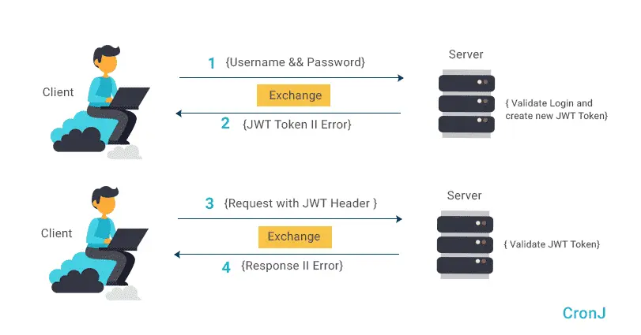

> [Title](https://www.cronj.com/blog/what-is-json-web-token-jwt)

---


> https://research.securitum.com/jwt-json-web-token-security/

## OAuth
<!-- _class: smaller-font -->

Gracias a OAuth, un usuario puede delegar el acceso a terceros a su cuenta de Google, Facebook, Twitter... sin necesidad de compartir contraseña

1. El usuario accede a un servicio de terceros (aplicación, página web...) que necesita acceder al Twitter, fotos de Google... del usuario
2. Twitter, Google confirma con el usuario que garantiza el acceso
3. Twitter, Google envían a la aplicación de terceros un **token** que la aplicación puede usar para acceder al contenido protegido


> https://aaronparecki.com/oauth-2-simplified/
> https://docs.oracle.com/cd/E55956_01/doc.11123/oauth_guide/content/oauth_intro.html

---
<!-- _class: with-warning -->

[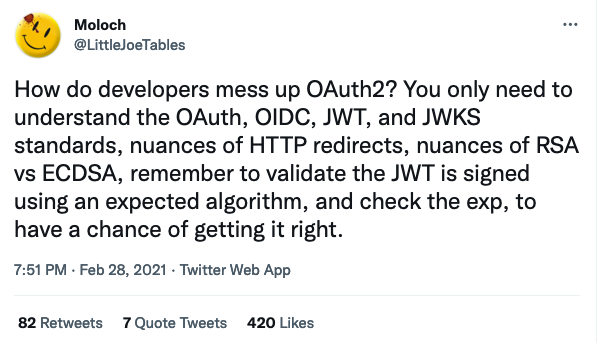](https://twitter.com/LittleJoeTables/status/1366098640482230281)

Cuidado: ¡implementar OAuth es complicado!

## Kerberos

- Desarrollado en el MIT en los 80
- Separa:
    - el servidor del autenticación
    - servidor de tokens
    - servicios finales
- Redes Windows corporativas: el *Authserver* es el *Domain Controller*


> Fuente: https://es.wikipedia.org/wiki/Kerberos
> [The Kerberos Version 5 (RFC4121, 2005)](https://datatracker.ietf.org/doc/html/rfc4121)

<!--
Kerberos se utiliza, por ejemplo, en redes Windows corporaivas: un usuario de dominio se autentica en el DC y obtiene un token que luego puede utilizar en cualquier ordenador de la empresa

CUIDADO: en los ciberataques actuales, los atacantes buscan por todos los medios hacerse con estos tokens
-->

## Windows


- En redes corporativas, identidades gestionadas de forma centralizada: **Active Directory**
- El usuario se autentica con Smartcard, PIN, contraseña, biometría...
- Las contraseñas se mantienen cifradas: SAM
- Los tickets/hashes se mantienen en la RAM del PC: LSASS
    - Tickets Kerberos
    - Hashes NT ó LN
    - En memoria RAM

> https://www.elastic.co/blog/introduction-to-windows-tokens-for-security-practitioners

---

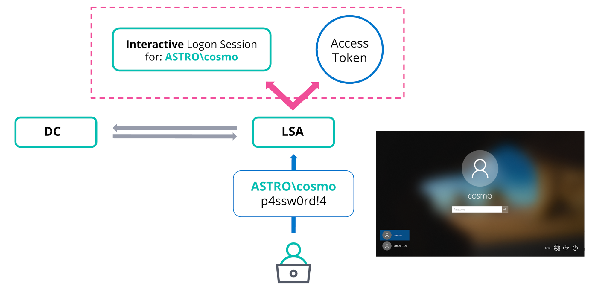

## Ataques

Se han descrito ataques contra TODOS estos sistemas

- [Reflection attack](https://en.wikipedia.org/wiki/Reflection_attack)
- [Pass the hash](https://en.wikipedia.org/wiki/Pass_the_hash)
- [Pass the token](https://o365blog.com/post/prt/)
- ...

El problema de la autenticación segura aún está a medio resolver en entornos complejos

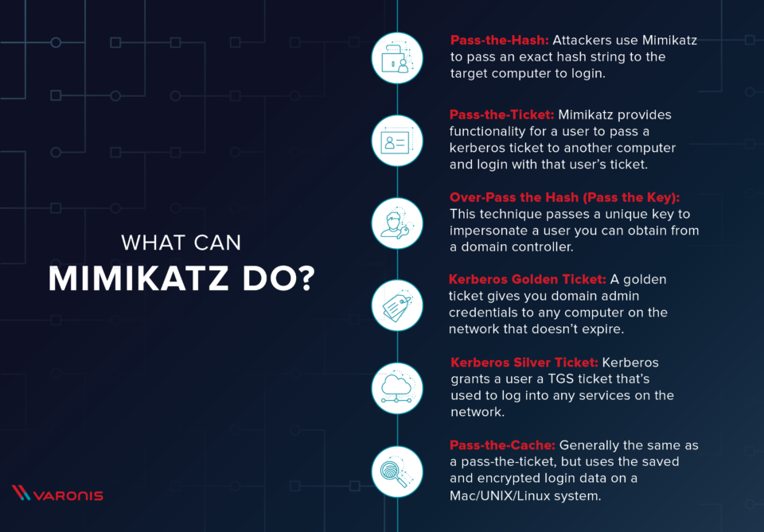

## *Lateral movement*

Piensa en una red Windows: si un atacante controla un equipo y se pone a escuchar las contraseñas que los trabajadores usan en ese equipo en concreto... ¡podría aprovechar estas contraseñas en otros equipos!

Esto no es tan raro: es la etapa *lateral movement* en cualquier ataque cibernético

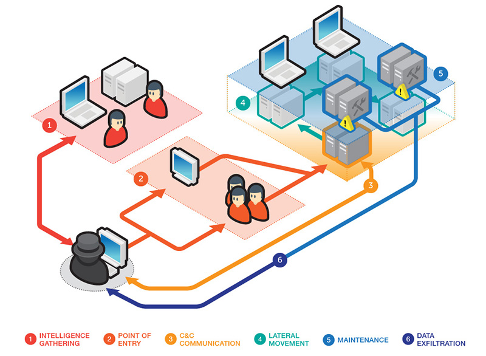

# Security Assertion Markup Language
<!-- _class: lead -->

## Security Assertion Markup Language

Security Assertion Markup Language (SAML) is an XML-based open-standard for transferring identity data between two parties: an identity provider (IdP) and a service provider (SP).

- Identity Provider — Performs authentication and passes the user's identity and authorization level to the service provider.

- Service Provider — Trusts the identity provider and authorizes the given user to access the requested resource.

---

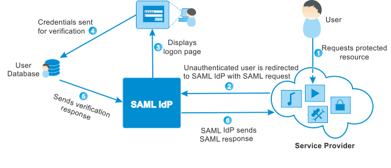

> https://bigdataanalyticsnews.com/how-does-saml-work/

## Benefits of SAML Authentication

- Improved User Experience — Users only need to sign in one time to access multiple service providers. This allows for a faster authentication process and less expectation of the user to remember multiple login credentials for every application. In the example above, that user could have clicked on any of the other icons in their dashboard and been promptly logged in without ever having to enter more credentials!

- Increased Security — SAML provides a single point of authentication, which happens at a secure identity provider. Then, SAML transfers the identity information to the service providers. This form of authentication ensures that credentials are only sent to the IdP directly.

- Loose Coupling of Directories — SAML doesn't require user information to be maintained and synchronized between directories.

- Reduced Costs for Service Providers — With SAML, you don't have to maintain account information across multiple services. The identity provider bears this burden.

# Resumen y referencias
<!-- _class: lead -->

## Resumen

- La autenticación es el servicio para probar que realmente estamos hablando con otra persona
- Si tenemos su clave pública, podemos desafiarle a que firme algo con su clave privada
- Si usamos usuario y contraseña, la base de datos no puede guardar esa información en claro
    - hash + salt
    - bcrypt / scrypt
- Lo ideal es que solo tengamos que "probar nuestra identidad" una vez, y el resto de peticiones funcionamos con tokens

## Recomendaciones generales

- Usar contraseñas aleatorias
- No reusar contraseñas
- Utilizar gestores de contraseñas
- Usar **siempre** doble factor de autenticación (2FA)
- Si es posible, "passwordless": Okta, Smartcards...

---

Pero procura no forzar a usar las "reglas tontas"

[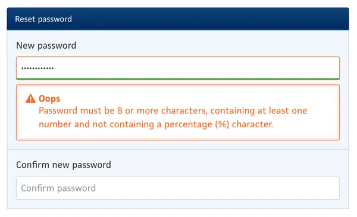](https://dumbpasswordrules.com/sites/)

¿Sabrías explicar por qué?

<!--
Si fuerzas "reglas para las contraseñas"...

- Baja la entropía de las contraseñas: los atacantes ya no tienen que probar contraseñas que no contengan  números
- No evitas que los usuarios acaben usando contraseñas sencillas que cumplan las reglas: S3samo!
- No evitas "trucos" como "Sesamo2022" "Sesamo2023"
-->

## Referencias

- [WebAuthn 101 - Demystifying WebAuthn](https://i.blackhat.com/USA-19/Thursday/us-19-Brand-WebAuthn-101-Demystifying-WebAuthn.pdf). Christiaan Brand, Google. Blackhat 2019
- [Kerberos Authentication Explained | A deep dive](https://www.youtube.com/watch?v=5N242XcKAsM)
- [What is OAuth really all about - OAuth tutorial - Java Brains](https://www.youtube.com/watch?v=t4-416mg6iU)
- [Why We Hash Passwords](https://dzone.com/articles/why-we-hash-passwords)
- [How SAML Authentication Works](https://auth0.com/blog/how-saml-authentication-works/#What-is-SAML)

---
<!-- _class: center -->

Continúa en:

- [Business Email Compromise (BEC)](06-bec.html)
- [Anonimato](07-anonimato.html)

---
<!-- _class: last-slide -->


