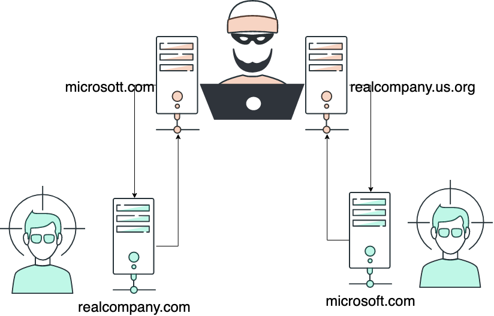
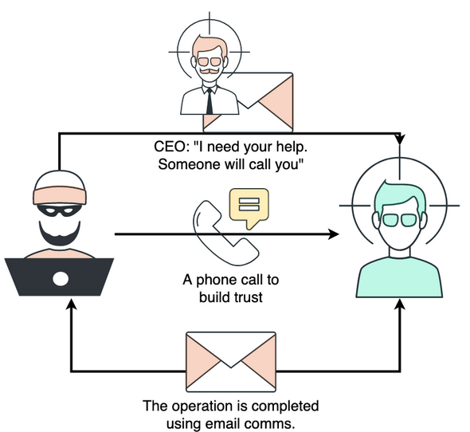
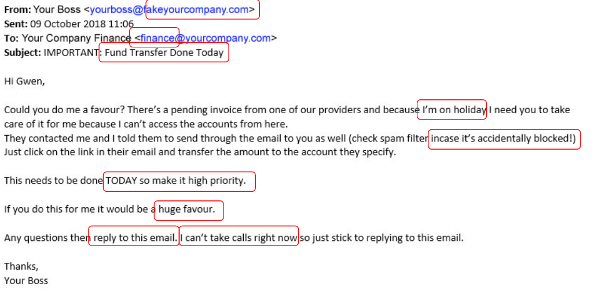
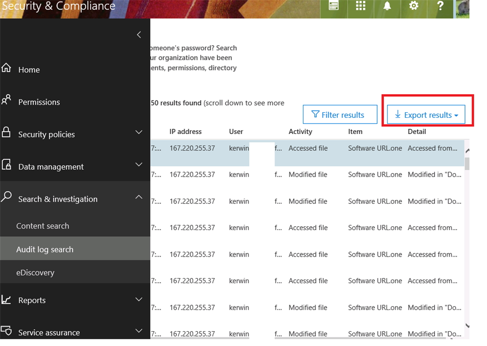

<style>
    /* You can add custom style here. VSCode supports this.
    Other editor might need these custom code in
    the YAML header: section: | */
	/* section header { display: none; } */
	/* section footer { display: none; } */
</style>

# Business Email Compromise
<!-- _class: first-slide -->

Juan Vera del Campo - <juan.vera@campusviu.es>

<!--
Las transparencias de hoy están en inglés
-->


# Contents
<!-- _class: cool-list with-warning toc -->

1. [Business Email Compromise (BEC)](#3)
1. [Types of Business Email Compromise (BEC)](#10)
1. [Investigating a BEC](#20)
1. [Prevention](#28)
1. [References](#43)

# Business Email Compromise (BEC)
<!-- _class: lead -->

---
<!-- _class: a-story -->


- You work for the finance department of a big company (100MM EUR)
- Your work involves transferring large amounts of money
- One day, you receive a phone call from a lawyer

> Note: background stock images from pexels: https://www.pexels.com/

---
<!-- _class: a-story -->


- You can google her name, she is involved in HUGE international operations
- She knows what she is talking about
- "Your company is in the middle of an important and confidential operation. We need your help. The CEO will contact you, please check the email"

---
<!-- _class: a-story -->


Dear employeer,

We are in the middle of a very important finantial operation to acquire one of our competitors. It is of the upmost importance that this operation remains confidential until it can be safely announced.

I will be busy with the details. Please, get in touch with the important lawyer (in copy of this email). Keep me in the email chain.

I hope you undestand the confidentiality and urgency of this operation.

Your boss

---
<!-- _class: a-story -->


- The important lawyer sends you a document, which includes a transfer order for 4M€
* The order is signed by your boss
* You transfer the money
* ...
* A couple of days later, your boss calls you about a unplanned money transfer you made to some unregistered location 

---

Do you believe you would never fall for this?

* ['CEO Spoofing' costs drug company $50 million](https://www.fox9.com/news/ceo-spoofing-costs-drug-company-50-million), 2015
* [Hackers siphon $47 million out of tech company's accounts](https://www.fox9.com/news/ceo-spoofing-costs-drug-company-50-million), 2015
* [Unusual CEO Fraud via Deepfake Audio Steals US$243,000 From UK Company](https://www.trendmicro.com/vinfo/us/security/news/cyber-attacks/unusual-ceo-fraud-via-deepfake-audio-steals-us-243-000-from-u-k-company), 2019
* [Un mail, una llamada y 4 millones robados a la EMT de València que volaron a Hong Kong: así fue el 'fraude del CEO' más salvaje de España ](https://www.eldiario.es/comunitat-valenciana/llamada-fabulosa-millones-emt-valencia_1_1243386.html), 2019
* [460,242 euro invoice due to pay to the Bilbao Club](https://www.majorcadailybulletin.com/news/local/2021/12/10/94245/mallorca-crime-alleged-ceo-scam-spain.html), 2021
* [Social engineering. CEO fraud of 9 million euros in the phishing scam to the biopharmaceutical company Zendal](https://kymatio.com/en/social-engineering-ceo-fraud-of-9-million-euros-in-the-phishing-scam-to-the-biopharmaceutical-company-zendal/), 2020.
* Most of them are covered up by the companies and never hit the news

---


> https://fr.wikipedia.org/wiki/Gilbert_Chikli
> https://www.dw.com/en/france-fraudsters-sentenced-over-bizarre-impersonation-scam/a-52729296
> https://mashable.com/article/gilbert-chikli-scam

<!--
Gilbert Chickli is an international cyberattacker specialized in this kind of scam. He has a huge team and he was able to steal millions of euros. His method is still in use today.

There is movie about his life: Je Compte sur Vous
-->

# Types of Business Email Compromise (BEC)
<!-- _class: lead -->

---

- **The Bogus Invoice Scheme**: attackers pretend to be suppliers requesting fund transfers for payments to an account owned by fraudsters
- **CEO Fraud**: Attackers pose as the company CEO or any executive and send an email to employees in finance, requesting them to transfer money to the account they control
- **Account Compromise**: An executive or employee’s email account is hacked and used to request invoice payments to vendors listed in their email contacts
- **Attorney Impersonation**: Attackers pretend to be a lawyer or someone from the law firm supposedly in charge of crucial and confidential matters
- **Data Theft**: Employees in HR and book-keeping are targeted to obtain personally identifiable information (PII) or tax statements of employees and executives. Such data can be used for future attacks

> https://www.trendmicro.com/vinfo/us/security/definition/business-email-compromise-(bec)

<!--
- BEC attackers rely heavily on social engineering tactics: attackers carefully research and closely monitor their potential target victims and their organizations
- Often, they impersonate CEO or any executive authorized to do wire transfers
- Some of the sample email messages have subjects containing words such as request, payment, transfer, and urgent, among others
-->

## Mail in the middle




<!--
Impersonation example: man-in-the-middle

The attacker sends an email to both ends with similar addresses but not quite the same. The text is "send further communications to..." or the "reply-to address is changed. i.e

Corporate or publicly available email accounts of employees related to finance are either spoofed or compromised

Objective: get an "email thread" where the other party is not involved

Beware: The attacker may impersonate several people: several accounts in CC, from several people...
-->

## BEC process

- The attacker impersonates a party sending a series of spoofed emails
    - Usually implies previous compromise to gain intelligence
- The first email may be from a legitimate **address**
    - ... but not necessarily a legitimate **server** (check your email client warnings!)
- `Reply-to` is changed
- Addresses similar to real ones to distinguish themselves:
    - `worker@bigconnpany.com` instead of `worker@bigcompany.com`
    - `worker@bigcompany.us` instead of `worker@bigcompany.com`
    - `goodworker@bigcompany.com` instead of `good.worker@bigcompany.com`

<!--

Question: this only work in a very precise moment: near the end of the service, when billing is about to be exchanged and trust is already built between the two parties. How does the attacker now about the perfect moment?

- Infiltration
- Luck
- An insider
- Patient

The three possibilities are real

If the attacker infiltrates the infrastructure, ost probably, all real emails between the two parties are going to "disappear". Check for automatic mail rules!. Beware: the infiltrated infrastructure maybe the victim's infrastructure or the other end of the communication!
-->

---


<!--
Most communications are transparently passed fro on channel to the other: you won't find anything strange in the communication apart from the fake address

The attacker intervenes when billing information is exchanged: in this moment, he/she presents her/his bank account
-->

## CEO Fraud



<!--
This is another type of this fraud. In this case, all mails are fake. There is no need to compromise the infrastructure. Acting skills are required.
-->

---


## Some RED flags

The CEO needs something from me!

- "*I need help, fast and in confidence*"
- "*You’ll be contacted by an attorney/an important partner*"
- "*I can’t be contacted ATM*"

Some acting is usually involved. Someone might call you!

---



> Other examples: <https://www.tessian.com/blog/covid-19-real-life-examples-of-opportunistic-phishing-emails-2/>

## Sextorsion


Beware: these fake extortions **MAY** include personal information collected from public sources!

# Investigating a BEC
<!-- _class: lead -->

## Something happened!

- The investigation usually starts with little knowledge: "I suspect we have been victim of fraud! The money just disappeared!" 
- You identify a probable BEC by running questions. Then, you review logs

---


## Objectives of the investigation

- When did the intrusion begin?
- How long did the threat actor maintain access? Is the actor still inside?
- Is there someone internal involved? 
- How to prevent future attacks?
- Insurance: did someone do something wrong?

> These are only an introduction for this presentation. Check: https://raw.githubusercontent.com/PwC-IR/Business-Email-Compromise-Guide/main/PwC-Business_Email_Compromise-Guide.pdf

---

[](https://www.youtube.com/watch?v=k0eECA2vwjQ)

## Opportunistic attacks

The attackers know exactly when to attack:

- The person they have to contact
- When the CEO is away the office and cannot be reached
- The precise moment they have to change bank accounts
- The involves parties

How did the attacker send the first email?

How did the attacker know it was the right moment?

## Control of the inbox

Email Collection : https://attack.mitre.org/techniques/T1114/

1. Identify accounts that could have been under the control of the attackers
1. Identify **dates**
1. **Any automatic rules: forward, move...**
1. **Authentication from strange places**
1. Is 2FA activated? Even with 2FA: is legacy authentication activated?


<!--
When an attacker access an account, he forwards emails to his own account. He is not interested only in past emails, also in future emails: when a deal is going to be closed, is there any additional email thread I must be aware...

Most of the times, they even hide this emails. His objective is that the victim won't receive any email from the other side, he is going to control all emails.
-->

## Where are the logs?

- On-premises: Exchange, dovecot...
- "In the cloud": Google Workspace, Microsoft 365... they usually have [audit logs](https://support.google.com/a/answer/4579579?hl=en) and [litigation modes](https://docs.microsoft.com/en-us/microsoft-365/compliance/create-a-litigation-hold?view=o365-worldwide). Warning: [they cost extra](https://workspace.google.com/pricing.html) and they must be activated BEFORE the incident



> https://answers.microsoft.com/en-us/msoffice/forum/all/office-365-admin-portal-logs/70ca8227-0c69-408f-a2c3-e2c8a8cadfb5

# Prevention
<!-- _class: lead -->

## Identifying inbox compromise

-  Forwarding rules are one of the most common tactics observed in BEC investigations.
-  Identifying suspicious login activity is useful for assessing initial access and lateral movement. 
-  Permission changes on existing or newly created accounts often indicate the threat  actor established persistence, and could indicate the scope of an investigation is wider than initially assessed. 
- Abusing OAuth applications or other vulnerabilities. 
- Assessing which emails or data has been accessed and/or exfiltrated is critical for  determining the impact on an organisation, including but not limited to financial losses, privacy implications and reputational damages. 
- Threat intelligence is an important part of the investigative process-
- BEC intrusions are typically opportunistic and attribution is difficult.

## External confirmation


- https://emailrep.io
- https://email-checker.net
- https://tools.emailhippo.com
- https://hunter.io/email-verifier
- https://trumail.io

## Threat intelligence

https://en.wikipedia.org/wiki/Cyber_threat_intelligence

- Learn about attacks before they happen
- Identify the registration of domains similar to your name: McDonals, ChinaExpor...
- Identify leaked passwords


<!--
BlueLiv is a company from Barcelona specialized in Threat Intelligence. If I'm not mistaken, they have open positions for students
-->


## Email forgery: PGP

Your contacts send their public keys to you manually. All communications from a contact must be signed using one of the accepted keys.

The perfect solution: sender signs the email, the receiver only accept emails from trusted parties


Bad news: PGP is rarely used in real life!

## Email forgery: SPF

Check in the DNS the sender IP is authorized to send emails from that server

i.e.: you authenticate the email <someone@gmail.com> was sent from a server authorized by GMail


> https://medium.com/@pendraggon87/short-primer-on-spf-dkim-and-dmarc-9827eb2f359d

## Email forgery: DomainKeys Identified Mail (DKIM)

The receiving **server** checks the digital signature of the sending **server**

Your server (not you!) authenticates the content received from the sending **server**, not the sending **user**!

i.e.: your email provider authenticates than an email sent from <someone@gmail.com> was not modified since it left `gmail.com`


> Fuente: https://dmarcian.es/what-is-dkim/
> RFC 6376: [DomainKeys Identified Mail (DKIM) Signatures](https://www.rfc-editor.org/info/rfc6376) September 2011

---

Received mails have an additional header:

```
DKIM-Signature: v=1; a=rsa-sha256; c=relaxed/relaxed; d=blackboard.com;
 s=sep2018; t=1670602715; bh=cS05YrQmiEH2S8VAGWK3wheZ287IPz+hfGXR1TsDY70=;
  h=Date:From:Subject:Reply-To; 
  b=gGHlf9eKK51Zw09JP98lOUgODgF61ZF7juJKDLjWLBxDDndvM8QMe4122XUO2wKgC
	 4SkqQkabmXk66gUsKIge9Z2pjnabs9klfTgZcCT13wxAUsIQur4SIJ+8f3a1sBnGTT
	 qSlMlB7ss5+0jIXVszWFtzkoHGPQ/UjVk9L24KGPwxRGyfGMI2JSgNHVWuP/61squO
	 rpG03vHZxsGyegGuXYt4/AADov8yNL3KVGq42bGAb7XKgt8MrtZGWA8GR9iWYIm3V1
	 6miGagayTXZANUbsdmtYtoPmxxdAuoOHiClnoXrdxhBFED8VrnhH8dMjd3ADZ1LaOA
	 LVRFXW1djkSrg==
```

- `d`: domain: `blackboard.com`
- `s`: selector `sep2018`
- `h`: headers fields: `Date:From:Subject:Reply-To;`.
- `bh`: body **hash**
- `b`: **signature** of headers and body

## Verification process
<!-- _class: with-info -->

- Get the body content, run canocalization algorithm `c`, calculate the hash value (`bh`). Check.
- Concatenate the headers in `h` and the `dkim` header (removing `b` but not `bh`)
- Download the server's public key from DNS using `d` and `s`
- Check the signature

Of course, there are libraries for this

---

Digital signature:

```
> dig backboard.com TXT
...
blackboard.com.		28800	IN	TXT	"v=spf1 include:
_netblocks.blackboard.com ...

> dig spf.blackboardconnect.com TXT
...
spf.blackboardconnect.com. 1800	IN	TXT	"v=spf1
ip4:34.215.79.96
ip4:34.213.216.156
...
DNS Record - sep2018._domainkey.blackboard.com
Selector - sep2018
Domain - blackboard.com 

20210112.estudiantat-upc-edu.20210112.gappssmtp.com. 3600 IN TXT
v=DKIM1;k=rsa;g=*;p=MIIBIjANBgkqhkiG9w0BAQEFAAOCAQ8AMIIBCgKCAQEAvs5qVO9zW6c
82vTZNGUA9YYZKfoxtSXGdG/+QEHe0Kg9D0wIuHobngn/+NmvYSmZ2KtdnQssTF93MhXBlQ8jX3
mjndj0tIaW6Snsm0+q68sJdzA7NtJBr4ljcEQRjq3jI6RQUrhs9gJ1DaKtws3SXMR8M72pQIbku
c5vkMxPCU5GPTj6TW9QweD/dZclLZ3o2AlcgONifoQY/7x2fV5GE9r55+xGB2m8yXKGeOybEkOA
G9goPDp4/XQVPHfX6+Icv/OflXQ+mAuzutgyeWAe0NvYaO6NiN0I2MkcgXACsuOVwCnLs9lPkWb
G9grZUEVz4wsJquAXgNQkse3eCpadIQIDAQAB
```

> https://www.dmarcanalyzer.com/dkim/dkim-checker/
> https://www.metaspike.com/leveraging-dkim-email-forensics/

## X-Google-DKIM: DomainKeys Identified Mail
<!-- _class: extra-slide -->

```
X-Google-DKIM-Signature: v=1; a=rsa-sha256; c=relaxed/relaxed;
        d=1e100.net; s=20161025;
        h=x-gm-message-state:mime-version:from:date:message-id:subject:to;
        bh=s7gErmNKwESPKSP6VW9kvRoEY/oQ8b6V1OFgRMqAjtU=;
        b=lB+wgPGej/d1HNLxj7oP1L9Mi56hwji5GA3hLrVYCRKohiAs3L7uI6fEq7sp7wBXKm
         9mOGnbIrSXMeOfOa/YnAnJg/4x6U5gvVtoisigFMR/bGxoPQRO6LUqvunBhR3il6f+OX
         ZRJIsZsvigsesD1vZcarlVr5D0QL2Cw2l1o1T6zVNH3Z8cmZNTCpfzmD3YmVCm+Cgdz9
         RQgX/iL12TxzzOmx+8yInGYnL9ZyaNY6Wsbi7LOBp7kRNLWrMKVtUlwuS2WSzQ5Jvwkm
         0SZ90S524hBquiF8WAzJI95AD/L5fr69sjaN/wM6pk8l6fTapm8+K6TsMPYrEhHtRFZ2
         vLYQ==
```

Google uses another DKIM signature that uses other headers. This is probably a signature to be used only inside Google. Still, it is a valid DKIM signature.

> https://mailarchive.ietf.org/arch/msg/apps-discuss/_blROpC5GpEPk96nBqKoNUaO5rg/

## Domain-based Message Authentication, Reporting & Conformance


- An email authentication, policy, and reporting protocol
- It **builds on the widely deployed SPF and DKIM protocols**
- With DMARC you can tell the world how to handle the unauthorized use of your email domains by instituting a policy in your DNS
    - `p=none`: monitors your email traffic. No further actions are taken.
    - `p=quarantine`: sends unauthorized emails to the spam folder.
    - `p=reject`: unauthorized email doesn’t get delivered at all.

> https://dmarc.org/

---


## The bad news...

- PGP is rarely used in real life... unfortunately
- Not all companies implement SPF or DKIM
- These mechanisms do not protect against an email sent from `macdonalds.com`: the attackers can configure SPF and DKIM too!
- These mechanisms only authenticate from the sending server to the receiving server!


<!--
- Los malos pueden configurar también sus servidores
- estos mecanismos no te protegerán contra direcciones "parecidas"
- SPF y DKIM solo autentican desde el servidor. ¿Quién estaba realmente escribiendo el mensaje?
    - Si el atacante ha conseguido crear cuentas: b0ss@company.com también pasará el DKIM de company.com
    - Si el atacante ha conseguido las credenciales de boss@company.com pasará el DKIM de company.com
-->

## Recommendations
<!-- _class: two-columns-list -->

<style scoped>
    ol { list-style-type: none;}
</style>

1. Admins:
    - Activate 2FA, disable legacy login
    - Activate mailbox auditing
    - Regularly, check rules
    - Train your users
1. Users:
    - Check the address of the other participant in the communication
    - Be careful if the address changes
    - Be careful if the language of the other participants change
    - Many email clients do alert when an address changes
    - Many email clients do alert if an Internet header is spoofed

# References
<!-- _class: lead -->

---

- [What is Business Email Compromise (BEC)? How Does it Work? ](https://www.tessian.com/blog/bec-business-email-compromise/), Tessian 2021
- [Business Email Compromise](https://www.fbi.gov/scams-and-safety/common-scams-and-crimes/business-email-compromise) FBI 
- [Business Email Compromise Guide for O365](https://github.com/PwC-IR/Business-Email-Compromise-Guide) - PwC 2021
- [Awesome-BEC: repository of information](https://github.com/randomaccess3/Awesome-BEC/blob/main/README.md)

---
<!-- _class: center -->

Continúa en: [Anonimato](07-anonimato.html)

# ¡Gracias!
<!-- _class: last-slide -->
